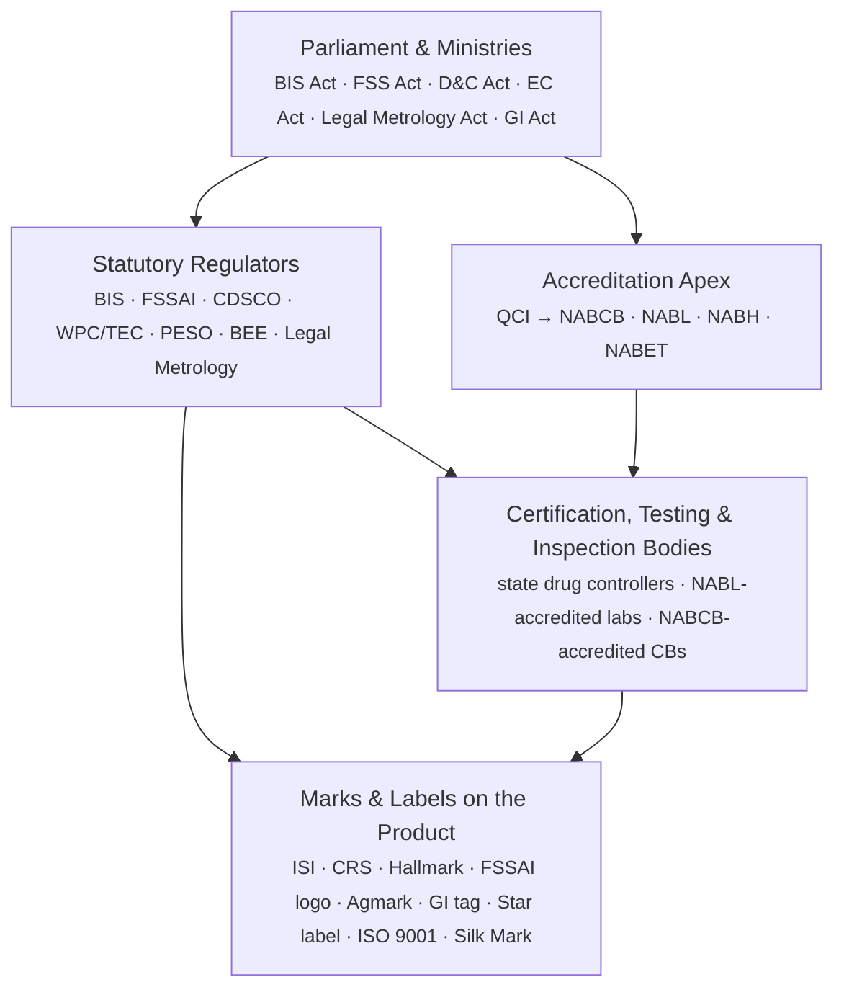

# How India Regulates Quality — Compendium

*Generated by `scripts/build_compendium.py` on 2026-09-24 from every page under `docs/` — a single-file version of the same content for offline reading or pasting elsewhere. The maintained source is `docs/`; re-run the generator after editing a doc page instead of hand-editing this file.*

This file is self-contained except for two things every entry still points back to the repository for: the mirrored primary-source files under `sources/...` (cited as code spans, e.g. `sources/bis-core/bis-isi-mark.pdf`), and each category's `sources/*/MANIFEST.md`. Open this file from the repository root for those paths to resolve; every other link in this document is an in-file anchor.

## Overview

BIS (the Bureau of Indian Standards) is the body most people name when they
think of "quality certification in India," but it shares the field with
roughly three dozen statutory regulators, accreditation boards and voluntary
marks. This repository maps who does what, grounded in the actual Acts,
Quality Control Orders, and scheme notifications behind each mark — not just
descriptions of them.

### The four-layer model

India doesn't regulate quality through one law or one authority. It runs as
a stack of four layers:



1. **Parliament and the ministries** write the Acts — the BIS Act, the Food
   Safety and Standards Act, the Drugs & Cosmetics Act, the Energy
   Conservation Act, the Legal Metrology Act, the Geographical Indications
   Act, and others.
2. **Statutory regulators** each own one slice of risk and issue licences or
   mandatory marks under their own Act — BIS, FSSAI, CDSCO, the WPC Wing and
   TEC (telecom), PESO, BEE, Legal Metrology, and more.
3. A separate **accreditation apex** — the Quality Council of India (QCI) and
   its constituent boards (NABCB, NABL, NABH, NABET) — doesn't certify
   products at all. It certifies the certifiers, auditors and labs that
   other regulators and the market rely on.
4. Beneath that sit the actual **certification, testing and inspection
   bodies** — some public (BIS itself, state drug controllers), most private
   but accredited — who do the testing and put a mark on the product.

Two things trip people up:

- **A mark can be mandatory for one product and voluntary for another.** The
  ISI mark is optional on most goods but compulsory the moment a product is
  named in a Quality Control Order (QCO) — over 150 product categories do
  today, and the list keeps growing (furniture joined in 2025; "Scheme-X"
  for machinery and electrical gear takes effect September 2026).
- **ISO certificates and government marks are different systems that share
  infrastructure.** An ISO 9001 certificate comes from a private
  certification body, but that body is only credible because NABCB (under
  QCI) accredited it. BIS also happens to sell ISO certification itself, as
  one certification body among many — that's a separate, voluntary
  commercial scheme, not a regulatory requirement.

### How this repository is organised

```
docs/
  00-overview.md                  — this file
  apex-accreditation/              — QCI, NABCB, NABL, NABH, NABET
  bis-core/                        — ISI mark, CRS, Hallmarking, BIS-as-a-CB, Ecomark, STQC
  food-agriculture/                — FSSAI, AGMARK, APEDA/NPOP, PGS-India, Spices/Tea/Coffee Boards, MPEDA
  health-pharma/                   — CDSCO, state drug controllers, AYUSH GMP
  energy-safety-environment/       — BEE star label, PESO, AERB, CPCB
  telecom-electronics/             — WPC/ETA, TEC/MTCTE
  textiles/                        — Silk Mark, Handloom Mark, Textiles Committee
  ip-trademarks/                   — GI Registry, Certification Trademarks
  legal-metrology/                 — Legal Metrology
  private-voluntary/               — Halal certification, Woolmark, GreenPro/IGBC/GRIHA

sources/
  <same categories>/               — mirrored primary-source PDFs/HTML (Acts, QCOs, notifications, scheme pages)
  <same categories>/MANIFEST.md    — origin URL, fetch date and notes for every mirrored file
```

Each page under `docs/` follows the same shape: authority, legal basis,
mandatory/voluntary status, what it actually certifies, the mark you'd see
on a product, and a link to the primary source mirrored under `sources/`.

### Reading the marks correctly

This is an orientation map, not a compliance checklist. Whether a specific
product needs BIS registration, which QCO applies, or which CDSCO device
class a product falls into depends on current notifications and changes
often. Verify against the regulator's current gazette notification before
relying on anything here for a filing. See each page's "Primary source"
link and its fetch date — a scheme notified after that date won't be
reflected yet.

## Apex & Accreditation Infrastructure

### National Accreditation Board for Certification Bodies (NABCB)

**Authority:** Constituent board of [Quality Council of India](#quality-council-of-india-qci)
**Status:** Infrastructure
**Established:** 1996
**Legal basis:** Operates under QCI's registered-society charter; accredits against ISO/IEC 17021 (management systems), ISO/IEC 17065 (product certification), ISO/IEC 17024 (personnel certification) and ISO/IEC 17020 (inspection); signatory to IAF and APAC Mutual Recognition Arrangements
**Marks issued:** None — accredits certification, inspection, and validation/verification bodies
**Source tier:** Official scheme/administrative page — no dedicated Act exists for this entry, so the body's own official page *is* the complete primary source.

#### Scope

NABCB is the board that makes ISO certificates (and a growing list of other
private-sector marks) credible in India. It doesn't touch a product or an
auditee directly — it assesses and accredits the certification bodies (CBs),
inspection bodies, and validation/verification bodies that do. A company that
wants an ISO 9001 or ISO 14001 certificate goes to a private CB; that CB's
certificate only carries international weight because NABCB accredited the CB
against ISO/IEC 17021, and because NABCB itself is a signatory to the
International Accreditation Forum (IAF) and Asia Pacific Accreditation
Cooperation (APAC) Multilateral/Mutual Recognition Arrangements. NABCB's remit
has broadened over time beyond classic management-system certification to
cover product certification bodies, organic-certification bodies (used
alongside [APEDA/NPOP](#apeda-npop-national-programme-for-organic-production) in the
food-agriculture category), and — increasingly — Halal certification bodies,
placing it next to the private, non-statutory Halal certifiers described
under [private-voluntary](#halal-certification). Note
the adjacent but separate BIS scheme: [BIS itself sells ISO
certificates](#bis-management-system-certification) as one CB
among many, and that scheme is in turn NABCB-accredited — so BIS is both a
statutory regulator (for the ISI mark) and, in this one scheme, just another
NABCB-accredited market participant.

#### Primary source

- [About NABCB](https://nabcb.qci.org.in/about-nabcb/) — mirrored at `sources/apex-accreditation/nabcb.html`, fetched 2026-09-24

#### Notes

- 1996 as NABCB's founding year (pre-dating QCI's own 1997 registration) is
  consistent with NABCB having been one of the original accreditation
  functions folded into QCI when QCI was set up; the "About NABCB" page
  itself does not print a specific founding date, so treat 1996 as
  well-sourced but not gazette-verified.
- NABCB's scope keeps expanding by notification rather than by a single
  founding Act — Halal-certification-body accreditation in particular is a
  recent (post-2023) addition worth re-checking against NABCB's current
  accreditation-scheme list before citing it as settled policy.

### National Accreditation Board for Education and Training (NABET)

**Authority:** Constituent board of [Quality Council of India](#quality-council-of-india-qci)
**Status:** Infrastructure
**Established:** 2006
**Legal basis:** Operates under QCI's registered-society charter, working with the Ministry of Environment, Forest and Climate Change (for EIA consultant accreditation) and various skilling ministries
**Marks issued:** None — accredits education, training and consultancy bodies
**Source tier:** Official scheme/administrative page — no dedicated Act exists for this entry, so the body's own official page *is* the complete primary source.

#### Scope

NABET is organised into three divisions — Education (school and formal-education
accreditation), Environment and Exploration (Environmental Impact Assessment
consultants and, historically, mining-plan/prospecting consultants), and
Training and Capacity Building (vocational training providers and skill
certification bodies). Its two most consequential scopes sit on opposite ends
of the economy: on one side it accredits schools (over 10,000 assessed,
by NABET's own figures) and vocational training organisations; on the other,
it is the body that accredits the EIA consultant organisations (330+) whose
environmental-clearance reports feed into project approvals under
environmental law — a role that puts it adjacent to
[CPCB](#cpcb-state-pcbs-pollution-control-boards) in the
energy-safety-environment category even though NABET itself accredits
*consultants*, not pollution sources. As with the other QCI boards, NABET
does not certify a product or hold statutory licensing power; a school or EIA
consultant is not legally barred from operating without NABET accreditation,
but government empanelment and many tender requirements make it a practical
necessity.

#### Primary source

- [About NABET](https://nabet.qci.org.in/about-nabet/) — mirrored at `sources/apex-accreditation/nabet.html`, fetched 2026-09-24

#### Notes

- NABET's homepage/about page does not state its 2006 founding year
  explicitly; 2006 is carried over from the pre-researched brief for this
  entry and is consistent with NABET being one of the later QCI boards
  (after NABCB/NABL in the 1990s and NABH in 2005) but was not independently
  gazette-verified from the fetched page.
- The "who-we-are" URL path returned HTTP 404 during this research; the live
  page is at `/about-nabet/` instead — noted in case the URL moves again.

### National Accreditation Board for Hospitals & Healthcare Providers (NABH)

**Authority:** Constituent board of [Quality Council of India](#quality-council-of-india-qci)
**Status:** Infrastructure
**Established:** 2005
**Legal basis:** Operates under QCI's registered-society charter; sets and assesses against its own patient-safety accreditation standards (not a single external ISO standard)
**Marks issued:** None — accredits hospitals, clinics and other healthcare facilities
**Source tier:** Official scheme/administrative page — no dedicated Act exists for this entry, so the body's own official page *is* the complete primary source.

#### Scope

NABH accredits healthcare *facilities* — hospitals, clinics, blood banks,
AYUSH hospitals, wellness centres, emergency departments, and (more recently)
digital-health platforms — against its own patient-safety and quality
standards. It is the outlier among QCI's boards in that it certifies
service-delivery organisations rather than accrediting other certification
or testing bodies one layer removed. Since its 2005 launch it has grown to
cover more than 29,000 accredited or certified healthcare facilities, and it
is reportedly the only accreditation body worldwide with a dedicated
Traditional Medicine accreditation track — independent standards for
Ayurveda, Yoga & Naturopathy, Unani, Siddha and Homoeopathy — which connects
it to the AYUSH-GMP regulatory strand covered under
[health-pharma](#ayush-gmp-premium-mark). NABH accreditation is
voluntary and distinct from the *statutory* licensing a hospital or drug
manufacturer needs from bodies like [CDSCO](#cdsco-central-drugs-standard-control-organisation) or a
state drug controller — a hospital can operate legally without NABH
accreditation, but many empanelments (insurance, government schemes) require
it in practice.

#### Primary source

- [Who We Are — NABH](https://nabh.co/who-we-are/) — mirrored at `sources/apex-accreditation/nabh.html`, fetched 2026-09-24

#### Notes

- The ">29,000 healthcare facilities" figure and the Traditional Medicine
  claim both come directly from NABH's own "Who We Are" page as fetched — a
  fast-moving number worth re-checking if cited later.
- NABH's four stated values (Credibility, Responsiveness, Transparency,
  Innovation) are marketing language from the source page, included here
  only for tone/context, not as a legal requirement.

### National Accreditation Board for Testing and Calibration Laboratories (NABL)

**Authority:** Constituent board of [Quality Council of India](#quality-council-of-india-qci); originally set up under the Department of Science & Technology
**Status:** Infrastructure
**Established:** 1998
**Legal basis:** Accreditation system operated in accordance with ISO/IEC 17011; voluntary accreditation schemes under ISO/IEC 17025 (testing/calibration labs), ISO 15189 (medical labs), ISO/IEC 17043 (proficiency testing providers), ISO 17034 (reference material producers)
**Marks issued:** None — accredits testing, calibration and medical-testing laboratories
**Source tier:** Official scheme/administrative page — no dedicated Act exists for this entry, so the body's own official page *is* the complete primary source.

#### Scope

NABL is the accreditation board that tells a regulator, a court, or a buyer
whether a lab's test results can be trusted. It accredits testing and
calibration laboratories against ISO/IEC 17025, and medical testing
laboratories against ISO 15189, plus newer scopes for proficiency-testing
providers and reference-material producers. NABL accreditation is voluntary
in itself, but it is the load-bearing layer underneath several *mandatory*
schemes described elsewhere in this repo: a lab that tests jewellery for [BIS
Hallmarking](#bis-hallmarking), or that produces the test
report a manufacturer submits for [BIS product
certification](#bis-isi-mark) or the [Compulsory Registration
Scheme](#bis-compulsory-registration-scheme-crs), is expected to be NABL-accredited (or
BIS-recognised on an equivalent basis) precisely so the regulator doesn't
have to re-verify every lab's competence itself. Like [NABCB](#national-accreditation-board-for-certification-bodies-nabcb), NABL
holds Mutual Recognition Arrangements with ILAC/APAC, so an NABL-accredited
test report is accepted internationally without re-testing.

#### Primary source

- [Introduction — NABL India](https://nabl-india.org/introduction/) — mirrored at `sources/apex-accreditation/nabl.html`, fetched 2026-09-24

#### Notes

- NABL's own "Introduction" page describes its accreditation system and
  standards coverage but does not state a founding year on that page; 1998
  is the commonly cited founding year (as an autonomous body under DST,
  before later becoming a QCI constituent board) and matches the
  pre-researched brief for this entry, but it is not gazette-verified from
  this fetch — worth confirming against an NABL annual report or the NABL
  100-series general-information document if a hard citation is ever
  needed.
- NABL also accredits Biobanks as a newer scope, beyond the four ISO
  standards listed above.

### Quality Council of India (QCI)

**Authority:** Public-Private Partnership — Government of India (anchored by DPIIT, Ministry of Commerce & Industry) with industry associations ASSOCHAM, CII and FICCI
**Status:** Infrastructure
**Established:** 1997
**Legal basis:** Registered society under the Societies Registration Act, 1860, set up on the recommendation of an EU expert mission and a 1996 Cabinet decision; DPIIT is the nodal ministry
**Marks issued:** None — accredits other bodies
**Source tier:** Official scheme/administrative page — no dedicated Act exists for this entry, so the body's own official page *is* the complete primary source.

#### Scope

QCI sits at the top of India's accreditation stack, one layer above the statutory
regulators described elsewhere in this repo. It does not test or certify any
product, service, person, or organisation itself. Instead it runs five
constituent boards that accredit the certifiers, auditors, and labs that
everyone else — BIS, FSSAI, CDSCO, hospitals, schools, exporters — relies on:
[NABCB](#national-accreditation-board-for-certification-bodies-nabcb) (certification, inspection and validation/verification
bodies), [NABL](#national-accreditation-board-for-testing-and-calibration-laboratories-nabl) (testing and calibration laboratories),
[NABH](#national-accreditation-board-for-hospitals-healthcare-providers-nabh) (hospitals and healthcare providers), [NABET](#national-accreditation-board-for-education-and-training-nabet)
(education, training, and EIA/energy-audit consultants), and the National
Board for Quality Promotion (NBQP, not covered as a separate page in this
repo — it runs QCI's outreach and India's national quality awards rather than
an accreditation scheme). QCI's founding was a direct government response to
India needing a WTO/TBT-compliant, internationally recognised accreditation
infrastructure rather than each ministry inventing its own. Ratan Tata was
QCI's first chairman. Because QCI itself issues no mark, every certification
mark or logo you actually see on a product or a hospital wall — from ISO 9001
to NABH accreditation — traces its credibility back through one of these four
boards to QCI, and from QCI to the DPIIT.

#### Primary source

- [Quality Council of India](https://qcin.org/) — mirrored at `sources/apex-accreditation/quality-council-of-india.html`, fetched 2026-09-24

#### Notes

- QCI marked 25 years in 2022 (founded 1997), and public explainer pieces
  consistently describe it as PPP-structured with DPIIT as the anchoring
  ministry — this repo follows that consensus rather than any single
  founding-charter PDF, since QCI's own site does not publish its 1997
  Memorandum of Association online.
- The fifth constituent board, NBQP (National Board for Quality Promotion),
  is intentionally out of scope for this 5-entry apex-accreditation set — it
  promotes quality culture and runs awards rather than accrediting
  conformity-assessment bodies, so it doesn't fit the "accredits the
  accreditors" pattern the other four follow.
- qcin.org returned HTTP 403 to a bare `curl` request (likely a bot-detection
  rule on user-agent) and only served content once a standard browser
  User-Agent header was sent — noted here in case the mirrored HTML looks
  unusually reliant on that workaround.

## Cross-Sector Statutory — BIS Core

### BIS — Compulsory Registration Scheme (CRS)

**Authority:** Bureau of Indian Standards (BIS), implementing an order issued by the Ministry of Electronics and Information Technology (MeitY)
**Status:** Mandatory
**Established:** 2012
**Legal basis:** Electronics and Information Technology Goods (Requirement for Compulsory Registration) Order, 2012 (S.O. 2357(E), dated 3 October 2012, issued under the (then) BIS Act, 1986), now administered under the BIS Act, 2016
**Marks issued:** BIS Standard Mark (CRS "R-number" mark) — visually distinct from the ISI mark
**Source tier:** Statutory / regulatory text — the Act, Rules, Regulations, Order or gazette notification itself is mirrored, not just a page about it.

#### Scope

CRS is a lighter-weight compulsory scheme than the [ISI mark](#bis-isi-mark),
built specifically for the fast-moving electronics and IT-hardware sector —
mobile chargers, laptops, power banks, LED lighting, batteries and similar
goods. Instead of BIS auditing the manufacturer's factory (as under Scheme-I),
CRS is a self-declaration-of-conformity model: the manufacturer gets the
product tested once against the applicable Indian Standard at a
BIS-recognised or [NABL-accredited](#national-accreditation-board-for-testing-and-calibration-laboratories-nabl)
laboratory, registers that test report with BIS, and then can affix the
Standard Mark with its unique registration number. No product in scope may
be manufactured, imported, stored for sale, sold or distributed in India
without that registration — it is fully mandatory, not the mixed
voluntary/compulsory pattern of the ISI mark. MeitY notified the original
order in 2012 covering an initial batch of electronics goods and has
expanded the product list in phases since. The underlying safety standard
for a large share of covered electronics is migrating to IS/IEC
62368-1:2023 (audio/video, IT and communication equipment safety), replacing
older IS 13252/60950-series standards — manufacturers re-certifying under
CRS need to track that transition.

#### Primary source

- [Electronics and Information Technology Goods (Requirement for Compulsory Registration) Order, 2012 — S.O. 2357(E)](https://egazette.gov.in/WriteReadData/2012/E_1975_2012_003.pdf) — mirrored at `sources/bis-core/bis-crs.pdf`, fetched 2026-09-24
- Full text: [`sources/bis-core/bis-crs.md`](sources/bis-core/bis-crs.md) (extracted, for search/offline reading)

#### Notes

- The mirrored PDF is a 10-page scanned Gazette of India notification dated
  2012 (OmniPage-OCR'd scan, per its embedded metadata) — confirmed genuine
  by page count and creation metadata, though it is not machine-text
  searchable.
- `egazette.nic.in` (the older domain some secondary sources still cite for
  this file) no longer resolves — the working mirror is on
  `egazette.gov.in`. Worth remembering for any other pre-2020 Gazette links
  in this repo.
- The dedicated CRS registration portal is `crsbis.in`, separate from
  `bis.gov.in` — useful for filing, not used here as a primary source since
  it's a transaction portal rather than the notification itself.

### BIS — Hallmarking

**Authority:** Bureau of Indian Standards (BIS), Ministry of Consumer Affairs
**Status:** Mandatory (gold); voluntary (silver)
**Established:** Scheme launched 2000; gold hallmarking made mandatory from June 2021
**Legal basis:** Bureau of Indian Standards Act, 2016, read with the BIS (Hallmarking) Regulations, 2018 (gazetted 14 June 2018) and subsequent amendments (2021, 2022, 2026)
**Marks issued:** BIS Hallmark (BIS logo + purity/fineness grade + six-digit alphanumeric HUID), applied via BIS-registered Assaying & Hallmarking Centres (AHCs)
**Source tier:** Statutory / regulatory text — the Act, Rules, Regulations, Order or gazette notification itself is mirrored, not just a page about it.

#### Scope

Hallmarking certifies the *purity* of precious-metal jewellery, not the
jewellery's design or manufacture quality. India brought gold under
mandatory hallmarking in phases starting June 2021; a Hallmark Unique
Identification (HUID) number was introduced the same year as the third
component of every hallmark, alongside the BIS logo and the caratage/fineness
grade — it lets a buyer or inspector look up a specific piece's assaying
centre and jeweller via the BIS CARE app or website, turning a physical stamp
into a traceable database record. Expansion has continued by district:
by early 2026 gold hallmarking covered roughly 380 districts across six
phases. Silver hallmarking, by contrast, remains voluntary as of this
writing — a jeweller who chooses to hallmark silver must still issue a HUID
under the revised IS 2112:2025 standard, but nothing compels them to
hallmark silver at all. The testing and assaying work is done by BIS-registered
AHCs, which sit at the same "certification/testing bodies" layer of the
[four-layer model](#overview) as
[NABL-accredited labs](#national-accreditation-board-for-testing-and-calibration-laboratories-nabl), though AHCs are
recognised directly by BIS under the Hallmarking Regulations rather than
accredited through NABL.

#### Primary source

- [BIS (Hallmarking) Regulations, 2018 — Gazette notification](https://www.bis.gov.in/bs/BIS_Hallmarking_Regulations_2018_Gazette_notification.pdf) — mirrored at `sources/bis-core/bis-hallmarking.pdf`, fetched 2026-09-24
- Full text: [`sources/bis-core/bis-hallmarking.md`](sources/bis-core/bis-hallmarking.md) (extracted, for search/offline reading)

#### Notes

- The mirrored PDF is a genuine 60-page Gazette scan (confirmed via
  `pdfinfo`: title "Microsoft Word - 3346gi", created 19 June 2018,
  Ghostscript-produced, 2,430,021 bytes matching the server's declared
  Content-Length) — it repeatedly truncated on ordinary `curl` downloads
  (bis.gov.in appears to throttle/reset large-file transfers) and needed
  resumed (`-C -`) downloads across two attempts to land intact; worth
  remembering for any other large PDF pulled from bis.gov.in in this repo.
- BIS has since amended these regulations multiple times (27 October 2021,
  4 March 2022, and again 14 September 2026 per BIS's own listing) — this
  mirror is the original 2018 regulation text, not a consolidated
  up-to-date version; treat the amendments as a to-do if a fully current
  text is ever needed.
- Silver-hallmarking-voluntary-but-HUID-required-if-done is a subtle,
  easy-to-misstate distinction — don't round it off to "silver is
  hallmarked" or "silver hallmarking is mandatory."

### BIS — ISI Mark

**Authority:** Bureau of Indian Standards (BIS), Department of Consumer Affairs, Ministry of Consumer Affairs, Food & Public Distribution
**Status:** Mixed
**Established:** 1955 (as the Indian Standards Institution mark; BIS itself constituted 1987, re-constituted under the 2016 Act)
**Legal basis:** Bureau of Indian Standards Act, 2016 (No. 11 of 2016), which repealed and replaced the BIS Act, 1986; product-specific Quality Control Orders (QCOs) issued under Section 16/17 of the 2016 Act make individual products compulsory
**Marks issued:** ISI mark (Scheme-I, compulsory registration under a QCO) and the general BIS product-certification mark (voluntary, outside a QCO)
**Source tier:** Statutory / regulatory text — the Act, Rules, Regulations, Order or gazette notification itself is mirrored, not just a page about it.

#### Scope

The ISI mark is India's oldest and most recognisable product-certification
mark, predating BIS itself — it goes back to the Indian Standards
Institution, BIS's 1947-founded predecessor. Certification is *voluntary by
default*: a manufacturer can apply for a licence to use the ISI mark on any
product for which an Indian Standard exists, going through BIS's Scheme-I
testing and factory-audit process. The mark becomes *compulsory* the moment a
product category is named in a Quality Control Order under the BIS Act,
2016 — at that point, selling the product in India without the mark is
illegal, not merely uncertified. Over 150 product categories are covered by
QCOs today, spanning steel, cement, toys, packaged drinking water,
electricals and more; the list keeps expanding — furniture joined in 2025,
and "Scheme-X" (a lighter-touch compulsory scheme aimed at machinery and
electrical equipment) is due to take effect in September 2026. The testing
behind an ISI licence typically runs through [NABL-accredited or
BIS-recognised laboratories](#national-accreditation-board-for-testing-and-calibration-laboratories-nabl); the mark itself
sits at the bottom "marks on the product" layer of the four-layer model
described in the [repo overview](#overview), directly under BIS as
the statutory regulator. It is worth distinguishing from three other BIS-run
schemes covered separately in this category: the lighter, self-declaration
[Compulsory Registration Scheme](#bis-compulsory-registration-scheme-crs) for electronics/IT hardware,
[Hallmarking](#bis-hallmarking) for precious metals, and BIS's own
commercial [Management System Certification](#bis-management-system-certification).

#### Primary source

- [The Bureau of Indian Standards Act, 2016 (No. 11 of 2016)](https://bis.gov.in/wp-content/uploads/2020/12/BIS-Act-2016-Bilingual.pdf) — mirrored at `sources/bis-core/bis-isi-mark.pdf`, fetched 2026-09-24
- Full text: [`sources/bis-core/bis-isi-mark.md`](sources/bis-core/bis-isi-mark.md) (extracted, for search/offline reading)

#### Notes

- The mirrored PDF is BIS's own bilingual copy of the Gazette notification
  (No. 12, New Delhi, Tuesday, March 22, 2016), 37 pages — confirmed by
  text extraction during this research, not just by filename.
- The Act came into force on 12 October 2017 (a later notified date), even
  though it was gazetted in March 2016 — don't conflate the two dates.
- "150+ product categories" and the September 2026 Scheme-X date are
  current as of this fetch but are exactly the kind of fast-moving
  regulatory facts the repo overview warns about — check BIS's live QCO
  list (`bis.gov.in/product-certification/products-under-compulsory-certification/`)
  before relying on a specific count or date.

### BIS — Management System Certification

**Authority:** Bureau of Indian Standards (BIS)
**Status:** Voluntary
**Established:** 1991 (Quality Management System / IS/ISO 9001 certification); scope expanded since
**Legal basis:** BIS Act (1986, now 2016) and Rules & Regulations framed thereunder; BIS's own Management Systems Certification Scheme (MSCS) accredited by [NABCB](#national-accreditation-board-for-certification-bodies-nabcb)
**Marks issued:** IS/ISO 9001 (Quality), IS/ISO 14001 (Environmental), IS/ISO 22000 (Food Safety), IS/ISO 45001 (Occupational Health & Safety) certificates, and Integrated Management System (IMS) certificates combining two or more of these
**Source tier:** Official scheme/administrative page — no dedicated Act exists for this entry, so the body's own official page *is* the complete primary source.

#### Scope

This is the one BIS-core entry that isn't really a *regulatory* scheme — it's
BIS acting as a commercial certification body (CB), competing directly with
private, [NABCB-accredited](#national-accreditation-board-for-certification-bodies-nabcb) CBs for the same
business: selling ISO 9001, ISO 14001, ISO 22000 and ISO 45001 certificates
(and combined IMS certificates) to organisations that want them. BIS has run
this Management Systems Certification Scheme (MSCS) since 1991, starting with
quality management (IS/ISO 9001) and adding environmental, food-safety and
occupational-health-and-safety schemes over time. Crucially, BIS's MSCS
itself is accredited by NABCB — the same board that accredits BIS's private
competitors — so a BIS-issued ISO 9001 certificate and a certificate from any
other NABCB-accredited CB carry equivalent international standing. This
scheme should not be confused with the statutory, compulsory marks BIS also
administers: [the ISI mark](#bis-isi-mark),
[the Compulsory Registration Scheme](#bis-compulsory-registration-scheme-crs), and
[Hallmarking](#bis-hallmarking) are all regulatory functions with legal
force behind them; MSCS is BIS simply selling a voluntary commercial service
in a market it does not otherwise regulate.

#### Primary source

- [Features of BIS Management Systems Certification Scheme (BIS MSCS)](https://bis.gov.in/wp-content/uploads/2018/11/Features-of-BIS-MSCS.pdf) — mirrored at `sources/bis-core/bis-management-system-certification.pdf`, fetched 2026-09-24
- Full text: [`sources/bis-core/bis-management-system-certification.md`](sources/bis-core/bis-management-system-certification.md) (extracted, for search/offline reading)

#### Notes

- The mirrored PDF is a genuine 3-page BIS document confirming the 1991
  start date and the "operating since 1991 under BIS Act, 1986" framing in
  its own opening lines (verified via text extraction).
- Worth flagging in the overview's "ISO certificates and government marks
  are different systems that share infrastructure" point: this page is the
  concrete example of that — BIS is simultaneously a statutory regulator
  (elsewhere) and, here, just another accredited commercial CB.

### BIS / MoEFCC — Ecomark

**Authority:** Ministry of Environment, Forest and Climate Change (MoEFCC), with the Bureau of Indian Standards (BIS) responsible for testing, certification and award of the label
**Status:** Voluntary
**Established:** 1991 (original scheme notification GSR 85(E), 21 February 1991); Ecomark Certification Rules re-notified 2023
**Legal basis:** Environment (Protection) Act, 1986 — Sections 3(1), 3(2)(ii), 6(1) and 25(1)
**Marks issued:** Ecomark (leaf-in-earthen-pot logo)
**Source tier:** Statutory / regulatory text — the Act, Rules, Regulations, Order or gazette notification itself is mirrored, not just a page about it.

#### Scope

Ecomark is India's answer to eco-labels like the EU Flower — a voluntary mark
for household and consumer products that meet both the relevant Indian
Standard's quality requirements *and* additional environmental criteria (low
toxicity, recyclability, reduced packaging, energy efficiency, and similar
factors depending on product category). It works as a two-ministry scheme:
MoEFCC sets the environmental criteria and issues the governing notification
under the Environment (Protection) Act, 1986, while
[BIS](#bis-isi-mark) does the testing and actually certifies and labels
qualifying products — the same BIS testing/certification machinery used for
the ISI mark, applied here to a voluntary environmental label rather than a
compulsory safety one. The scheme has had strikingly low market uptake since
1991 despite being one of India's oldest eco-labelling efforts; MoEFCC
revisited it via a draft "Ecomark Certification Rules, 2023" notification
(11 October 2023), which explicitly re-invokes and supersedes the original
1991 notification while keeping the same core Ecomark label and its
BIS-testing structure, and coverage/uptake questions have continued into
later notifications tied to the government's "Lifestyle for Environment"
(LiFE) initiative.

#### Primary source

- [Ecomark Certification Rules, 2023 — Gazette notification, MoEFCC (11 October 2023)](https://egazette.gov.in/WriteReadData/2023/249354.pdf) — mirrored at `sources/bis-core/ecomark.pdf`, fetched 2026-09-24
- Full text: [`sources/bis-core/ecomark.md`](sources/bis-core/ecomark.md) (extracted, for search/offline reading)

#### Notes

- Confirmed by direct text extraction (Hindi/English bilingual Gazette,
  Extraordinary, Part II Section 3(ii), No. 4270, dated 11 October 2023):
  the notification is a *draft* published for public objections/suggestions
  within 30 days, and it explicitly refers back to and supersedes the
  original Ecomark notification GSR 85(E) of 21 February 1991 — so this PDF
  is genuinely the right primary source for both the 1991 origin and the
  2023 update, not just the update alone.
- Secondary sources reference a further "Ecomark Rules, 2024" notification
  and continuing LiFE-initiative activity — if this page is revisited, check
  whether a final (non-draft) 2024 or later Ecomark Rules notification has
  since superseded the 2023 draft mirrored here.
- Implementation coordination with CPCB (Central Pollution Control Board,
  covered under [energy-safety-environment](#cpcb-state-pcbs-pollution-control-boards))
  is mentioned in secondary reporting around this scheme — worth
  cross-checking if that page is written.

### STQC (Standardisation Testing and Quality Certification)

**Authority:** Ministry of Electronics and Information Technology (MeitY)
**Status:** Mixed
**Established:** 1980
**Legal basis:** MeitY directorate (departmental, not a separate statutory body — operates as part of MeitY rather than under its own Act)
**Marks issued:** STQC test/certification reports and Common Criteria certificates; no single product mark equivalent to the ISI mark
**Source tier:** Official scheme/administrative page — no dedicated Act exists for this entry, so the body's own official page *is* the complete primary source.

#### Scope

STQC is MeitY's in-house testing-and-certification directorate for the IT
and electronics domain — the sectoral counterpart to what BIS is for general
consumer goods, but organised as a government directorate rather than a
statutory body with its own Act. Its work spans four broad service lines:
IT-product and e-governance-application testing, calibration, certification
services, and training. In practice this covers testing devices in the
Aadhaar ecosystem (biometric capture devices, authentication devices) before
they can be deployed at scale, evaluating e-governance software and
applications for quality and security, and running India's Common Criteria
(ISO/IEC 15408) scheme for IT-security evaluation of products used in
sensitive/government deployments. STQC's status is "mixed" because some of
its testing is a hard gate for deployment (e.g. Aadhaar device
certification, which vendors cannot bypass if they want their devices used
in the UIDAI ecosystem) while other services (general IT product testing,
training) are offered on a voluntary, fee-for-service basis. Unlike
[BIS](#bis-isi-mark) or the [CRS](#bis-compulsory-registration-scheme-crs), STQC does not operate
under a dedicated Act or a product-specific Quality Control Order — its
authority derives from being MeitY's own technical directorate plus the
individual scheme rules (e.g. UIDAI's device-certification requirements)
that reference it.

#### Primary source

- [About STQC](https://www.stqc.gov.in/about-stqc) — mirrored at `sources/bis-core/stqc-about.html`, fetched 2026-09-24. Unlike the bare homepage, this page carries real descriptive prose: STQC's role as a MeitY attached office, its four service lines (Testing, Calibration, IT & e-Governance, Certification), its lab/centre network (ERTLs, ETDCs, IT Centres, CFR, IIQM), and its QMS/ISMS/ITSM certification track record.
- [STQC — Standardisation Testing and Quality Certification Directorate (homepage)](https://www.stqc.gov.in/) — kept as secondary — mirrored at `sources/bis-core/stqc.html`, fetched 2026-09-24

#### Notes

- The "About STQC" page above supplies a firmer primary citation for STQC's
  scope/mandate than the homepage did; the "established 1980" fact is still
  sourced from secondary listings (Wikipedia, MeitY organisational pages)
  since neither STQC page states a founding year directly.
- A candidate MeitY PDF (`meity.gov.in/static/uploads/2024/10/bfb7eb2a620f12ee4ef86aa6bd0fa618.pdf`)
  was also checked: it is a 2024 recruitment advertisement, not a scheme
  document — it repeats the same "about STQC" boilerplate paragraph but
  isn't a better primary source than the About STQC page above, so it
  wasn't mirrored.
- STQC recently launched a "SATYA" lab-automation portal (per a 2026 PIB
  release) — a sign the directorate is still actively modernising its
  testing infrastructure, not a legacy/dormant body.

## Food & Agriculture

### AGMARK

**Authority:** Directorate of Marketing & Inspection (DMI), Department of Agriculture & Farmers Welfare, Ministry of Agriculture & Farmers Welfare
**Status:** Mixed
**Established:** 1937
**Legal basis:** Agricultural Produce (Grading and Marking) Act, 1937
**Marks issued:** AGMARK
**Source tier:** Statutory / regulatory text — the Act, Rules, Regulations, Order or gazette notification itself is mirrored, not just a page about it.

#### Scope

AGMARK certifies agricultural and allied produce — ghee, honey, spices,
cereals, pulses, edible/vegetable oils, vegetable ghee, and more — against
grade standards that DMI fixes under the 1937 Act and its General Grading
and Marking Rules. A producer or packer applies for a Certificate of
Authorisation, and DMI (through its own laboratories, state agencies, or
recognised graders) inspects batches and permits the AGMARK label. Coverage
is mostly voluntary — a producer chooses it as a quality signal — but it was
historically mandatory for blended edible vegetable oil and vegetable fat
spreads under the Food Safety and Standards (Prohibition and Restriction on
Sales) Regulations administered by [FSSAI](#fssai-food-safety-standards-authority-of-india).
FSSAI's October 2024 amendment removed the AGMARK mandate specifically for
multi-sourced edible vegetable oil, so AGMARK's compulsory footprint has
been shrinking rather than growing. It is the oldest quality-certification
scheme in this repository, predating independence by a decade.

#### Primary source

- [Agricultural Produce (Grading and Marking) Act, 1937 (as amended)](https://agmarkonline.dmi.gov.in/writereaddata/DMI/files/15364146815b93d3d9ab807A1937-1.pdf) — mirrored at `sources/food-agriculture/agmark.pdf`, fetched 2026-09-24
- Full text: [`sources/food-agriculture/agmark.md`](sources/food-agriculture/agmark.md) (extracted, for search/offline reading)

#### Notes

- Cross-check against [FSSAI](#fssai-food-safety-standards-authority-of-india)'s 2024/2025
  Prohibition and Restrictions on Sales amendments before assuming AGMARK is
  mandatory for any specific product today — the list of AGMARK-mandatory
  categories has narrowed in recent years, and vegetable oil (historically
  the headline mandatory category) is no longer on it.
- DMI's public-facing domain has migrated over time (`dmi.gov.in` →
  `agmarkonline.dmi.gov.in`); the mirrored PDF came from the current
  `agmarkonline.dmi.gov.in` host.

### APEDA — NPOP (National Programme for Organic Production)

**Authority:** Agricultural and Processed Food Products Export Development Authority (APEDA), Ministry of Commerce & Industry
**Status:** Voluntary
**Established:** 2001
**Legal basis:** Foreign Trade (Development & Regulation) Act, 1992
**Marks issued:** India Organic
**Source tier:** Statutory / regulatory text — the Act, Rules, Regulations, Order or gazette notification itself is mirrored, not just a page about it.

#### Scope

NPOP is an accreditation programme, not a direct product-certification
scheme: it accredits the third-party certification bodies that in turn
inspect organic farms, processors and traders, and it sets the national
standards those bodies certify against — playing the same "certifies the
certifiers" role in the export/organic-food space that QCI's NABCB plays
generally elsewhere in this repository. Products certified under an
NPOP-accredited body may carry the "India Organic" mark. NPOP's standards
are recognised as equivalent by the European Union and Switzerland, which is
what makes NPOP certification (rather than the cheaper domestic
[PGS-India](#pgs-india-participatory-guarantee-system) route) the one exporters
actually need. Participation is entirely voluntary — a grower or exporter
opts in because export markets or premium domestic retail demand it, not
because any Act requires it. The programme is now in its 8th standards
edition (2024); NPOP-covered organic production for 2024–25 ran to roughly
4.69 million tonnes, with about 368,000 tonnes exported.

#### Primary source

- [National Programme for Organic Production (NPOP), 8th Edition, 2024](https://npop.apeda.gov.in/sites/default/files/2024-10/NPOP_Eight_Edition_2024.pdf) — mirrored at `sources/food-agriculture/apeda-npop.pdf`, fetched 2026-09-24
- Full text: [`sources/food-agriculture/apeda-npop.md`](sources/food-agriculture/apeda-npop.md) (extracted, for search/offline reading)

#### Notes

- The official presence is split across several APEDA subdomains
  (`apeda.gov.in`, `npop.apeda.gov.in`, `organic.apeda.gov.in`) — all
  legitimate, just inconsistently linked from each other.
- NPOP is administered under the Foreign Trade (Development & Regulation)
  Act, 1992 rather than a dedicated organic-farming Act — there is no
  standalone "NPOP Act."

### FSSAI (Food Safety & Standards Authority of India)

**Authority:** Ministry of Health & Family Welfare
**Status:** Mandatory
**Established:** 2008 (Act enacted 2006; Authority operationalised 2008)
**Legal basis:** Food Safety and Standards Act, 2006
**Marks issued:** FSSAI licence number / registration mark (printed on packaging)
**Source tier:** Statutory / regulatory text — the Act, Rules, Regulations, Order or gazette notification itself is mirrored, not just a page about it.

#### Scope

FSSAI is the single mandatory licensing and registration authority for every
food business operator in India, from a street vendor (basic registration)
to a large manufacturer or importer of packaged food (state or central
licence, tiered by turnover and risk category). The 2006 Act consolidated a
patchwork of older laws — the Prevention of Food Adulteration Act, the Fruit
Products Order, the Meat Food Products Order, and several others — into one
statute and one regulator, which now also sets food safety standards,
labelling rules, and additive/contaminant limits. A notable 2024 change
narrows how much other marks matter for food: the Food Safety and Standards
(Prohibition and Restrictions on Sales) First Amendment Regulations, 2024
(gazetted 17 October 2024) removed the requirement for a separate Bureau of
Indian Standards (BIS) certification mark on packaged drinking/mineral water
and on certain milk products, and removed the requirement for a separate
[AGMARK](#agmark) certification mark on multi-sourced
edible vegetable oil. For those categories, a valid FSSAI licence and
standards compliance is now sufficient on its own — FSSAI remains the
umbrella regulator that export-facing bodies like the
[Spices Board](#tea-board-coffee-board) and
[MPEDA](#mpeda-marine-products-export-development-authority) sit alongside for domestic-market food
safety.

#### Primary source

- [Food Safety and Standards Act, 2006](https://fssai.gov.in/upload/uploadfiles/files/FOOD_ACT.pdf) — mirrored at `sources/food-agriculture/fssai.pdf`, fetched 2026-09-24
- Full text: [`sources/food-agriculture/fssai.md`](sources/food-agriculture/fssai.md) (extracted, for search/offline reading)
- [Food Safety and Standards (Prohibition and Restrictions on Sales) Regulations — consolidated compendium, Version XI (02.04.2025), reflecting the BIS/AGMARK omission](https://fssai.gov.in/upload/uploadfiles/files/Comp_Prohibition%20and%20Restrcition%20of%20sales%20XI_01042025.pdf) — mirrored at `sources/food-agriculture/fssai-2024-prohibition-amendment-gazette.pdf`, fetched 2026-09-24
- Full text: [`sources/food-agriculture/fssai-2024-prohibition-amendment-gazette.md`](sources/food-agriculture/fssai-2024-prohibition-amendment-gazette.md) (extracted, for search/offline reading)

#### Notes

- The BIS/AGMARK-omission change is often dated "February 2024" in trade
  press, which is when FSSAI's governing body approved it; the operative
  legal date is the gazette notification on 17 October 2024. The mirrored
  file here is FSSAI's own consolidated compendium (Version XI, current to
  April 2025) rather than the standalone amendment notification, since it
  gives the full current text rather than just a diff — search-indexed
  copies of the original October 2024 gazette PDF on fssai.gov.in returned
  the site's React app shell instead of the file when fetched directly, so
  the compendium was used instead. It explicitly references
  "F. No. Stds/Agmark-BIS/02/FSSAI-2018" confirming the AGMARK/BIS carve-out
  history.
- The change is narrow: it applies only to the specific listed categories
  (packaged/mineral water, certain milk products, multi-sourced edible
  vegetable oil). It does not abolish AGMARK or BIS certification generally
  — both remain mandatory or voluntary elsewhere per their own rules.

### MPEDA (Marine Products Export Development Authority)

**Authority:** Ministry of Commerce & Industry
**Status:** Mandatory (for exporters)
**Established:** 1972
**Legal basis:** Marine Products Export Development Authority Act, 1972
**Marks issued:** MPEDA processing-plant approval number; HACCP-based sanitary certification
**Source tier:** Statutory / regulatory text — the Act, Rules, Regulations, Order or gazette notification itself is mirrored, not just a page about it.

#### Scope

MPEDA was constituted on 24 August 1972 under Act No. 13 of 1972, replacing
the earlier Marine Products Export Promotion Council (1961). It is the
statutory gatekeeper for India's seafood export trade: exporters must
register with MPEDA, and processing plants must be inspected and approved
against HACCP-based sanitary standards before their output can be exported
— a pre-shipment inspection regime built to satisfy importing-country
requirements, especially the EU and US. Because registration and plant
approval are a precondition for *export* specifically, not for selling
seafood domestically, this entry is marked "Mandatory (for exporters)"
rather than a blanket mandatory mark like [FSSAI](#fssai-food-safety-standards-authority-of-india)
licensing. MPEDA also funds aquaculture extension, market promotion, and
testing-fee-based laboratory services; the labs it approves sit in the same
certification/testing layer as NABL-accredited labs described in this
repository's `apex-accreditation/` category, though MPEDA's approval is
sector-specific to seafood rather than a general laboratory accreditation.

#### Primary source

- [Marine Products Export Development Authority Act, 1972](https://thc.nic.in/Central%20Governmental%20Acts/Marine%20Products%20Export%20Development%20Authority%20Act,%201972..pdf) — mirrored at `sources/food-agriculture/mpeda.pdf`, fetched 2026-09-24
- Full text: [`sources/food-agriculture/mpeda.md`](sources/food-agriculture/mpeda.md) (extracted, for search/offline reading)

#### Notes

- MPEDA's own site (`mpeda.gov.in/?page_id=472`, "MPEDA Act & Rules") exists
  but does not expose a directly fetchable Act PDF link in its rendered
  HTML. The India Code bitstream copies
  (`indiacode.nic.in/bitstream/123456789/1665/1/aA1972-13.pdf` and the
  `/3/A1972-13.pdf` variant) both timed out repeatedly from this
  environment rather than returning a clean 200 or an explicit block, so
  they were not used. The mirrored copy instead comes from Tripura High
  Court's `thc.nic.in` central-Acts library — an official `.nic.in` legal
  repository, not MPEDA's own domain, but a verifiable government mirror of
  the same statutory text. If MPEDA's own site becomes scrapable later,
  prefer re-mirroring directly from `mpeda.gov.in`.

### PGS-India (Participatory Guarantee System)

**Authority:** Ministry of Agriculture & Farmers Welfare (National Centre of Organic Farming, under the Paramparagat Krishi Vikas Yojana)
**Status:** Voluntary
**Established:** 2011
**Legal basis:** Scheme notification under PKVY — no dedicated Act
**Marks issued:** PGS-India Organic (Green, certified) / PGS-India Organic (Grey, in-conversion)
**Source tier:** Official scheme/administrative page — no dedicated Act exists for this entry, so the body's own official page *is* the complete primary source.

#### Scope

PGS-India is a low-cost, peer-review certification system for organic
produce sold in the domestic Indian market. Farmers organise into local
groups and cross-verify each other's practices under a shared code of
conduct, with oversight from Regional Councils and the National Centre of
Organic Farming acting as national secretariat — replacing a paid
third-party auditor with mutual accountability among growers. This makes it
far cheaper and more accessible to small and marginal farmers than
third-party certification, which is also its central limitation: PGS-India
certification is **not accepted for export**. An exporter needs
[APEDA's NPOP](#apeda-npop-national-programme-for-organic-production) third-party
certification instead, since that is the scheme foreign regulators (EU,
Switzerland) recognise as equivalent. PGS-India runs as a scheme under the
Paramparagat Krishi Vikas Yojana rather than under any dedicated Act.

#### Primary source

- [PGS-India — Participatory Guarantee System](https://pgsindia-ncof.gov.in/pgs-india) — mirrored at `sources/food-agriculture/pgs-india.html`, fetched 2026-09-24

#### Notes

- No PDF Act exists to mirror — PGS-India has no founding statute, only
  scheme guidelines and portal documentation, so the official HTML landing
  page is the primary source per this repository's convention for
  scheme-based (non-statutory) entries.
- Distinguish carefully from NPOP in any cross-reference: PGS-India =
  domestic market, peer review, cheap; NPOP = export market, third-party
  audit, EU/Switzerland-recognised.

### Spices Board India

**Authority:** Ministry of Commerce & Industry
**Status:** Voluntary
**Established:** 1987 (Act passed 1986; Board constituted 26 February 1987)
**Legal basis:** Spices Board Act, 1986
**Marks issued:** Spices Board quality/premium-grade certification marks; Certificate of Registration as Exporter of Spices (CRES)
**Source tier:** Statutory / regulatory text — the Act, Rules, Regulations, Order or gazette notification itself is mirrored, not just a page about it.

#### Scope

The Spices Board administers export promotion and quality control for the
52 spices scheduled under the Spices Board Act, 1986, having absorbed the
functions of the earlier Cardamom Board (under the Cardamom Act, 1965) and
the Spices Export Promotion Council. Anyone exporting scheduled spices must
register with the Board for a CRES; the Board separately runs voluntary
quality-certification and premium-grading schemes, quality-improvement and
R&D programmes, and support for HACCP/ISO adoption among spice exporters and
processors. Domestic retail spice quality — packaged spice blends sold
within India — instead falls under [FSSAI](#fssai-food-safety-standards-authority-of-india)
and, historically, [AGMARK](#agmark) grading. The
Spices Board's certification marks are specifically an export-market
quality differentiator, not a domestic-sale requirement, which is why this
entry is marked Voluntary rather than Mandatory even though exporter
*registration* itself is compulsory.

#### Primary source

- [The Spices Board Act, 1986 — full text](https://indiankanoon.org/doc/134656725/) — mirrored at `sources/food-agriculture/spices-board-act.html`, fetched 2026-09-24
- [Spices Board — genesis and statutory background (RTI disclosure page)](http://spicesboard.in/public/rti/1.1.6.html) (secondary/administrative reference) — mirrored at `sources/food-agriculture/spices-board.html`, fetched 2026-09-24

#### Notes

- **2026-09-24 fix:** recovered the bare Act full text from IndianKanoon. The Act text had previously proved hard to mirror: the Ministry of Commerce copy
  (`commerce.gov.in/wp-content/uploads/2020/04/SB_Act_Rules_English.pdf`)
  404s, and the India Code bitstream copy
  (`indiacode.nic.in/bitstream/123456789/1872/4/a1986-10.pdf`) is confirmed dead from this environment (per the repo-wide exclude list in `.lychee.toml`) — that host was not retried. `legislative.gov.in`'s `lddashboard` subdomain, tried first per the standard preference order, timed out the same way. IndianKanoon doesn't expose a single obvious "bare act" URL for this one — its per-section pages (e.g. `/doc/193865957/` for Section 1) all link out to a shared "Entire Act" document, `https://indiankanoon.org/doc/134656725/`, which was fetched and verified to contain the full ~7,100-word text (Chapters I–VII: Preliminary, the Board, Cardamom-estate registration, CRES, Central Government control, finance/accounts/audit, and miscellaneous). The `spicesboard.in` RTI page is retained as a secondary/administrative reference for the Act's legislative history.

### Tea Board / Coffee Board

**Authority:** Ministry of Commerce & Industry
**Status:** Mixed
**Established:** Tea Board — 1954 (Tea Act, 1953); Coffee Board — 1942 (Coffee Act, 1942)
**Legal basis:** Tea Act, 1953; Coffee Act, 1942
**Marks issued:** Darjeeling Tea (Geographical Indication), Tea Board orthodox/logo mark, Coffee Board grading and quality marks
**Source tier:** Statutory / regulatory text — the Act, Rules, Regulations, Order or gazette notification itself is mirrored, not just a page about it.

#### Scope

Two separate statutory commodity boards under the Commerce Ministry, each
running export-quality grading, control orders and market promotion for its
crop. The **Tea Board**, set up under Section 4 of the Tea Act, 1953 and
operational from 1 April 1954, licenses tea estates and factories, registers
exporters, oversees replanting/replantation subsidies, and — notably — is
the registered proprietor and custodian of the Darjeeling Tea geographical
indication, one of India's best-known GI tags (cross-reference the
`ip-trademarks/` category in this repository for the GI Registry mechanics).
The **Coffee Board**, established under the Coffee Act, 1942 — one of the
oldest commodity-board statutes still in force — ran a compulsory pooling
and marketing monopoly for Indian coffee until deregulation in the 1990s;
today it focuses on quality certification, grading, R&D, and export
promotion, with growers free to sell in the open market. Both boards mix
mandatory elements (registration, certain control orders) with voluntary
ones (premium grading, GI use, promotional certification), which is why
this combined entry is marked Mixed.

#### Primary source

- [Tea Act, 1953 (with Rules)](https://www.teaboard.gov.in/pdf/policy/tea_act_and_rule.pdf) — mirrored at `sources/food-agriculture/tea-board-coffee-board.pdf`, fetched 2026-09-24
- Full text: [`sources/food-agriculture/tea-board-coffee-board.md`](sources/food-agriculture/tea-board-coffee-board.md) (extracted, for search/offline reading)
- [Coffee Act, 1942 (with Rules)](https://coffeeboard.gov.in/CoffeeBoard/Coffee_Act_Rules.pdf) — mirrored at `sources/food-agriculture/tea-board-coffee-board-coffee-act.pdf`, fetched 2026-09-24
- Full text: [`sources/food-agriculture/tea-board-coffee-board-coffee-act.md`](sources/food-agriculture/tea-board-coffee-board-coffee-act.md) (extracted, for search/offline reading)

#### Notes

- This entry covers two Acts and two boards under one combined page (per
  the task list), so two source files are mirrored under the same slug —
  `tea-board-coffee-board.pdf` for tea, `tea-board-coffee-board-coffee-act.pdf`
  for coffee.
- The India Code copy of the Coffee Act (`indiacode.nic.in`) timed out
  repeatedly when fetched directly; `coffeeboard.gov.in`'s own act-and-rules
  PDF worked and is the more directly authoritative source anyway (the
  regulator's own copy rather than a legislative archive's).
- The Coffee Board's compulsory pooling/marketing monopoly (all coffee sold
  through the Board) ran until liberalisation in 1996; the Board itself
  dates to the 1942 Act. Confirm the exact operational-start date against
  the Act text if precision matters for a filing.

## Health, Pharma & AYUSH

### AYUSH — GMP & Premium Mark

**Authority:** Ministry of AYUSH, with the Quality Council of India (QCI) as scheme manager for the voluntary mark
**Status:** Mixed (GMP certification mandatory; AYUSH Standard/Premium Mark voluntary)
**Established:** Schedule T added to the Drugs and Cosmetics Rules in 2000; AYUSH Mark certification scheme launched January 2010 (QCI-run since 2009)
**Legal basis:** Drugs and Cosmetics Act, 1940 and Rules, 1945 — Schedule T (GMP for Ayurvedic, Siddha and Unani drugs, made under Rule 157); AYUSH Mark Certification Scheme (QCI/Ministry of AYUSH scheme document)
**Marks issued:** AYUSH Standard Mark, AYUSH Premium Mark
**Source tier:** Statutory / regulatory text — the Act, Rules, Regulations, Order or gazette notification itself is mirrored, not just a page about it.

#### Scope

The Ministry of AYUSH regulates Ayurvedic, Siddha, Unani and Homoeopathy (ASU&H) drug manufacturing through the same central Drugs and Cosmetics Act, 1940 framework that CDSCO administers for allopathic drugs — but through its own schedule. Schedule T of the Drugs and Cosmetics Rules, 1945 lays down mandatory Good Manufacturing Practice requirements for ASU drug manufacturers: factory premises standards, hygienic conditions, recommended machinery and equipment, and in-house quality-control requirements, with licensing handled by the relevant [state drug controller](#state-drug-controllers). On top of this mandatory floor sits the voluntary AYUSH Mark Certification Scheme, developed by the Ministry of AYUSH with QCI as scheme manager and accreditation body: it has two tiers, the AYUSH Standard Mark (based on domestic Schedule T/GMP compliance) and the AYUSH Premium Mark (aligned to WHO GMP and other stricter international benchmarks, aimed at manufacturers exporting ASU&H products). Certification is carried out by NABCB-accredited third-party certification bodies against the scheme document, not by the Ministry directly. As of the scheme's public reporting, over a hundred products carry the Premium Mark and roughly twice that number the Standard Mark — small numbers relative to India's ASU&H manufacturing base, reflecting the mark's voluntary, export-oriented niche.

#### Primary source

- [Schedule T, Drugs and Cosmetics Rules, 1945](https://cdsco.gov.in/opencms/export/sites/CDSCO_WEB/Pdf-documents/acts_rules/2016DrugsandCosmeticsAct1940Rules1945.pdf) (See Rule 157) — "Good Manufacturing Practices for Ayurvedic, Siddha and Unani Medicines," the actual mandatory-GMP legal text — mirrored at `sources/health-pharma/ayush-schedule-t.pdf`, fetched 2026-09-24. This is a fuller CDSCO consolidation of the Drugs and Cosmetics Act, 1940 + Rules, 1945 (635 pp, all Schedules) than the Act-only PDF already mirrored for [CDSCO](#cdsco-central-drugs-standard-control-organisation) (`sources/health-pharma/cdsco.pdf`, 64 pp) — that shorter file does **not** contain Schedule T, confirmed by direct text search; this longer one does, starting at its page ~553 ("SCHEDULE T (See rule 157)").
- Full text: [`sources/health-pharma/cdsco.md`](sources/health-pharma/cdsco.md) (extracted, for search/offline reading)
- Full text: [`sources/health-pharma/ayush-schedule-t.md`](sources/health-pharma/ayush-schedule-t.md) (extracted, for search/offline reading)
- [Ayush Mark Certification Scheme](https://www.pib.gov.in/PressReleasePage.aspx?PRID=1843836) (Press Information Bureau, Government of India) — the voluntary AYUSH Mark scheme announcement, kept as secondary — mirrored at `sources/health-pharma/ayush-gmp-premium-mark.html`, fetched 2026-09-24

#### Notes

- The Ministry of AYUSH's own site (`ayush.gov.in`) hosts Schedule T and scheme material, but its content-heavy subdomains — `main.ayush.gov.in` and `ayushnext.ayush.gov.in`, both cited by search results as the canonical AYUSH Mark pages — do not currently resolve in DNS (confirmed via two independent resolvers, not just a local network issue), and `ayush.gov.in` itself serves a JavaScript-rendered single-page app that returns 404/empty content to a non-browser fetch. The PIB press release remains the best available source specifically for the voluntary AYUSH Mark scheme document itself (as opposed to the mandatory Schedule T GMP floor, now covered above); treat it as an entry point, not the full scheme text.
- No separate AYUSH Premium Mark scheme notification was found on an `ayush.gov.in` path outside the JS-shell root during this pass.
- Two certification bodies were named at the scheme's 2010 launch (FOODCERT Hyderabad and Bureau Veritas Bombay); the current NABCB-accredited CB list should be checked at the time of use rather than assumed static.
- Don't confuse Schedule T (mandatory GMP floor) with the AYUSH Mark (voluntary, export-grade signal) — a manufacturer can be fully legal under Schedule T without ever pursuing the AYUSH Mark.

### CDSCO (Central Drugs Standard Control Organisation)

**Authority:** Ministry of Health and Family Welfare (Directorate General of Health Services)
**Status:** Mandatory
**Established:** 1940 (as the office administering the Drugs Act; modern CDSCO structure dates to the Drugs Controller General of India role)
**Legal basis:** Drugs and Cosmetics Act, 1940 (Act No. 23 of 1940) and Rules, 1945; Medical Devices Rules, 2017
**Marks issued:** Import/manufacturing licences and registration certificates (Form MD-5, MD-9, and drug-specific forms) — not a consumer-facing mark like ISI or FSSAI's logo
**Source tier:** Statutory / regulatory text — the Act, Rules, Regulations, Order or gazette notification itself is mirrored, not just a page about it.

#### Scope

CDSCO is India's national drug regulatory authority, headquartered at FDA Bhawan, Kotla Road, New Delhi, with six zonal offices, four sub-zonal offices, thirteen port offices and seven central laboratories. Under the Drugs and Cosmetics Act it regulates the approval of new drugs and clinical trials, sets standards for drugs and cosmetics, controls the quality of imported drugs, and coordinates with [state drug controllers](#state-drug-controllers) who handle most manufacturing licensing on the ground. Since the Medical Devices Rules, 2017 came into force (1 January 2018), CDSCO also risk-classifies medical devices into Class A (low risk) through Class D (high risk); Class C and D devices require a CDSCO registration certificate/manufacturing licence (Form MD-9 for manufacture, MD-5 registration route for import), while Class A/B devices are licensed by the state authority under central oversight. CDSCO's Drugs Controller General of India (DCGI) is the approving authority for new drugs, large-volume parenterals, vaccines, and blood products across the country. It shares the health-regulation space with the [Ministry of AYUSH's GMP/Premium Mark scheme](#ayush-gmp-premium-mark), which covers the separate universe of Ayurvedic, Siddha, Unani and Homoeopathy drugs.

#### Primary source

- [The Drugs and Cosmetics Act, 1940 and Rules, 1945](https://cdsco.gov.in/opencms/resources/UploadCDSCOWeb/2022/acts_and_rules/Drugs%20and%20Cosmetics%20Act,%201940.pdf) — mirrored at `sources/health-pharma/cdsco.pdf`, fetched 2026-09-24
- Full text: [`sources/health-pharma/cdsco.md`](sources/health-pharma/cdsco.md) (extracted, for search/offline reading)

#### Notes

- The Medical Devices Rules, 2017 (a separate, more recent instrument) is the operative text for device classification and licensing; CDSCO hosts it at `cdsco.gov.in` but the mirrored file here is the founding Act + Rules, since that is the base legal authority under which the 2017 Rules were made.
- CDSCO's site structure changes acts/rules PDF paths periodically (several older links returned 404 during this research) — if the mirrored URL breaks, search `cdsco.gov.in` for "Drugs and Cosmetics Act 1940" rather than assuming the file moved off the domain.
- The class-based device risk regime (A–D) is one of CDSCO's most consequential post-2017 changes: it shifted India from an "everything needs central approval" model to a risk-tiered one, pushing low/moderate-risk devices down to the state layer.

### State Drug Controllers

**Authority:** State/Union Territory governments (each operates its own Drugs Control Department / State Drugs Regulatory Authority)
**Status:** Mandatory
**Established:** Varies by state; role created by the Drugs and Cosmetics Act, 1940 itself, which delegates the bulk of manufacturing and sale licensing to state governments
**Legal basis:** Drugs and Cosmetics Act, 1940 and Rules, 1945 (state authorities act as "State Licensing Authority" under the Act, in coordination with [CDSCO](#cdsco-central-drugs-standard-control-organisation))
**Marks issued:** Manufacturing licences (Form 25, Form 28 and equivalents), sale licences, Class A/B medical device manufacturing licences — not a product mark
**Source tier:** Official scheme/administrative page — no dedicated Act exists for this entry, so the body's own official page *is* the complete primary source.

#### Scope

Every Indian state and union territory runs its own drug control department, generically referred to as the State Drugs Regulatory Authority or state drug controller. This is the regulator most pharmaceutical and cosmetic manufacturers actually deal with day to day: it issues manufacturing licences for the overwhelming majority of drugs and cosmetics sold in India, inspects manufacturing premises for Good Manufacturing Practice (GMP) compliance under Schedule M of the Drugs and Cosmetics Rules, and handles sale/distribution licensing (retail and wholesale drug licences). Under the Medical Devices Rules, 2017, state authorities also license Class A (low-risk) and Class B (moderate-risk) medical devices, while [CDSCO](#cdsco-central-drugs-standard-control-organisation) retains direct licensing authority for the higher-risk Class C and D devices — a split that puts most day-to-day device manufacturing compliance in state hands too. CDSCO coordinates and audits this network (it maintains national online licensing infrastructure, including the ONDLS/`statedrugs.gov.in` portal built with C-DAC), but does not itself replace the state licensing function except for the small set of categories reserved centrally (large-volume parenterals, vaccines, blood products, new drugs, and Class C/D devices).

#### Primary source

- [State Drugs Control](https://cdsco.gov.in/opencms/opencms/en/State-Drugs-Control/) — mirrored at `sources/health-pharma/state-drug-controllers.html`, fetched 2026-09-24

#### Notes

- There is no single "state drug controller Act" — the legal basis is the same central Drugs and Cosmetics Act, 1940 that underpins CDSCO; states execute functions the Act and Rules assign to the "State Licensing Authority."
- This is a genuinely federated system: 36 states/UTs each run their own inspectorate with varying capacity, which is a recurring theme in pharma-industry compliance commentary (uneven enforcement, staffing shortages) — worth keeping in mind when reading this page as an "orientation," not a guarantee of uniform practice.
- The ONDLS/`statedrugs.gov.in` portal referenced by CDSCO is the practical entry point for tracking which state authority issued a given licence.

## Energy, Safety & Environment

### AERB (Atomic Energy Regulatory Board)

**Authority:** Department of Atomic Energy, Government of India
**Status:** Mandatory
**Established:** 1983 (15 November 1983, by an order of the President under the Atomic Energy Act)
**Legal basis:** Atomic Energy Act, 1962 (Act No. 33 of 1962); AERB also draws authority from the Environment (Protection) Act, 1986 for certain notifications
**Marks issued:** Licences/consents for nuclear and radiation facilities (via the e-LORA electronic licensing system) — not a product mark
**Source tier:** Statutory / regulatory text — the Act, Rules, Regulations, Order or gazette notification itself is mirrored, not just a page about it.

#### Scope

AERB is India's nuclear and radiological safety regulator, constituted under the Atomic Energy Act, 1962 to ensure that the use of ionising radiation and nuclear energy does not pose undue risk to people or the environment. Its remit is broader than nuclear power plants alone: AERB licenses and inspects nuclear fuel-cycle facilities, industrial radiography sources, and — the category most people actually encounter — medical diagnostic and therapeutic radiation equipment. No medical X-ray or CT installation may legally operate without an AERB licence; manufacturers, suppliers and service agencies must also obtain consents, and procurement of X-ray equipment requires prior AERB permission and NOC-validated/type-approved equipment. AERB administers all of this online through its e-LORA (Electronic Licensing of Radiation Applications) portal. AERB has in recent notices warned that facilities operating diagnostic X-ray equipment without a valid licence will be sealed without further notice, signalling active enforcement against a historically under-regulated segment (small diagnostic clinics).

#### Primary source

- [The Atomic Energy Act, 1962](https://www.aerb.gov.in/images/PDF/Atomic-Energy-Act-1962.pdf) — mirrored at `sources/energy-safety-environment/aerb.pdf`, fetched 2026-09-24
- Full text: [`sources/energy-safety-environment/aerb.md`](sources/energy-safety-environment/aerb.md) (extracted, for search/offline reading)

#### Notes

- The mirrored Act text is the foundational legal basis; day-to-day X-ray/radiography licensing is governed by AERB safety codes, guides and the e-LORA procedural rules built under this Act, not the Act's text directly — those are a logical follow-up mirror if this section is expanded later.
- The scope of "who needs an AERB licence" is wider than the words "atomic energy" suggest — it was a genuine surprise during this research how much of AERB's actual enforcement activity (per its own public notices) concerns ordinary medical/dental X-ray clinics rather than nuclear facilities.

### BEE — Star Label

**Authority:** Bureau of Energy Efficiency (BEE), Ministry of Power
**Status:** Mandatory (for notified appliance categories; voluntary for others pending notification)
**Established:** 2006 (Standards & Labelling programme launched May 2006, under BEE which was itself set up in 2002)
**Legal basis:** Energy Conservation Act, 2001 (Section 14 empowers mandatory labelling; Section 58 empowers BEE to frame regulations)
**Marks issued:** BEE Star Label (1–5 stars)
**Source tier:** Statutory / regulatory text — the Act, Rules, Regulations, Order or gazette notification itself is mirrored, not just a page about it.

#### Scope

BEE runs the Standards & Labelling (S&L) programme, which rates the energy efficiency of notified appliances and equipment on a 1-to-5 star scale so buyers can compare running costs, not just purchase price. The programme started with 11 mandatory categories in 2006 and has expanded steadily; as of recent notifications it covers roughly 30 appliance/equipment categories (room air conditioners, refrigerators, ceiling fans, LED lamps, distribution transformers, washing machines, televisions, water heaters and more), some mandatory and some still voluntary pending a compliance ramp. Star labelling was made compulsory for a further batch of appliances — including frost-free and direct-cool refrigerators, deep freezers, certain room-AC types, grid-connected solar inverters and distribution transformers — from 1 January 2026 under a fresh notification, reportedly the largest single expansion of the mandatory list in the programme's twenty-year history. Selling a notified appliance without a valid, current-rating label is prohibited. BEE also runs non-labelling programmes (PAT scheme for large industry, ECBC for buildings) under the same Act, but the Star Label is the consumer-facing mark most people encounter.

#### Primary source

- [Gazette notification No. 5506/BEE/S&L/AL/2025-26](https://egazette.gov.in/WriteReadData/2025/268894.pdf) — the Bureau of Energy Efficiency (Appliance Labelling and Compliance) Regulations, 2026, dated 26 December 2025 and published in the Gazette of India (Extraordinary) on 29 December 2025 — mirrored at `sources/energy-safety-environment/bee-star-label-sl-scheme.pdf`, fetched 2026-09-24. This is the actual S&L scheme regulation, issued under Section 58(1) of the Energy Conservation Act, 2001, and is what expands the mandatory-labelling list from 1 January 2026 (frost-free/direct-cool refrigerators, deep freezers, certain room-AC types, grid-connected solar inverters, distribution transformers, etc.) referenced below.
- Full text: [`sources/energy-safety-environment/bee-star-label-sl-scheme.md`](sources/energy-safety-environment/bee-star-label-sl-scheme.md) (extracted, for search/offline reading)
- [The Energy Conservation Act, 2001](https://cdnbbsr.s3waas.gov.in/s3716e1b8c6cd17b771da77391355749f3/uploads/2024/02/20240219558401063.pdf) (hosted via the NIC/S3WaaS government cloud, mirroring the same Act published at `beeindia.gov.in`) — the parent Act; kept as secondary/background — mirrored at `sources/energy-safety-environment/bee-star-label.pdf`, fetched 2026-09-24
- Full text: [`sources/energy-safety-environment/bee-star-label.md`](sources/energy-safety-environment/bee-star-label.md) (extracted, for search/offline reading)

#### Notes

- `beeindia.gov.in` still does not serve a fetchable primary document for the S&L scheme itself to a non-browser client: every scheme/regulation URL on that domain found via search resolved to the same HTML app-shell regardless of path. The actual regulation text was found instead on `egazette.gov.in` (the official Gazette of India host) by searching for the regulation's exact name plus "gazette pdf", then constructing the item's direct `WriteReadData/<year>/<id>.pdf` URL from the id surfaced by a gazette-tracking secondary source — not guessed.
- A companion document — "Guidelines for Permittee — Standards and Labeling Program of BEE" (the S&L programme's operating guidelines, 39 pp) — was also found live and fetchable at `https://www.beestarlabel.com/Content/Files/Scheme%20of%20energy%20efficiency%20labelling.pdf` (BEE's own labelling-portal domain, distinct from `beeindia.gov.in`) and could be added as a further secondary source if procedural/permittee detail is needed later; not mirrored in this pass since the gazette regulation is the stronger primary citation.
- The Standards & Labelling programme is separate from BEE's PAT (Perform, Achieve, Trade) scheme for large industrial consumers and the Energy Conservation Building Code (ECBC) — both exist under the same Act but aren't covered by this entry.

### CPCB / State PCBs (Pollution Control Boards)

**Authority:** Central Pollution Control Board (Ministry of Environment, Forest and Climate Change), with State Pollution Control Boards / Pollution Control Committees at the state/UT level
**Status:** Mandatory
**Established:** 1974 (CPCB constituted under the Water Act; given additional powers under the Air Act in 1981)
**Legal basis:** Water (Prevention and Control of Pollution) Act, 1974; Air (Prevention and Control of Pollution) Act, 1981; Water (Prevention and Control of Pollution) Cess Act, 1977
**Marks issued:** Consent to Establish (CTE) and Consent to Operate (CTO) — regulatory clearances, not a consumer mark; co-administers the Ecomark scheme with BIS
**Source tier:** Statutory / regulatory text — the Act, Rules, Regulations, Order or gazette notification itself is mirrored, not just a page about it.

#### Scope

CPCB was constituted in September 1974 under the Water (Prevention and Control of Pollution) Act, 1974, and was given parallel powers and functions under the Air (Prevention and Control of Pollution) Act, 1981. It sets national ambient air- and water-quality standards, coordinates the activities of State Pollution Control Boards (SPCBs) and Pollution Control Committees (in union territories), and provides technical assistance to the Ministry. The functional regulatory work most industrial units actually experience is done at the state level: SPCBs issue the "Consent to Establish" (CTE, under Water Act s.25/26 and Air Act s.21) before construction begins, and "Consent to Operate" (CTO) before the unit starts running, then monitor compliance, inspect facilities and can initiate prosecution for violations. Several states are consolidating this into unified online portals (e.g. Delhi's and Goa's Online Consent Management & Monitoring Systems), and a national Unified Consent and Authorization Management System has been proposed. Separately from consents, CPCB co-administers the voluntary Ecomark scheme for environmentally friendly products together with BIS — see [../bis-core/ecomark.md](#bis-moefcc-ecomark) for the labelling side of that arrangement (link will resolve once that page exists in this repo).

#### Primary source

- [The Water (Prevention and Control of Pollution) Act, 1974](https://cpcb.nic.in/upload/home/water-pollution/WaterAct-1974.pdf) — mirrored at `sources/energy-safety-environment/cpcb-state-pcbs.pdf`, fetched 2026-09-24
- Full text: [`sources/energy-safety-environment/cpcb-state-pcbs.md`](sources/energy-safety-environment/cpcb-state-pcbs.md) (extracted, for search/offline reading)

#### Notes

- The mirrored document covers the Water Act, 1974 specifically; the Air Act, 1981 (also confirmed reachable at `cpcb.nic.in/displaypdf.php?id=...`) was not separately mirrored to keep one representative founding Act per entry per the task scope — both Acts share the same CPCB/SPCB institutional structure described above.
- `cpcb.nic.in/consent-management/` is the live page referencing the CTE/CTO process and the proposed unified portal, but was not mirrored separately; it's a good next fetch if this entry is expanded.
- The `../bis-core/ecomark.md` cross-link is aspirational — that file does not yet exist in this repo as of this research pass (the `bis-core/` docs folder is currently empty); the link is included per the task's request to cross-link related entries and will resolve once that page is written.

### PESO (Petroleum and Explosives Safety Organisation)

**Authority:** Department for Promotion of Industry and Internal Trade (DPIIT), Ministry of Commerce and Industry
**Status:** Mandatory
**Established:** 1898 (as the Department of Explosives under British rule; renamed PESO in 2007)
**Legal basis:** Explosives Act, 1884; Static and Mobile Pressure Vessels (Unfired) Rules, 2016 (successor to the 1981 Rules)
**Marks issued:** Licences for manufacture/storage/import/export of explosives; petroleum storage licences; pressure vessel/LPG cylinder approvals — not a consumer product mark
**Source tier:** Statutory / regulatory text — the Act, Rules, Regulations, Order or gazette notification itself is mirrored, not just a page about it.

#### Scope

PESO is India's oldest surviving safety regulator, tracing back to the 1898 Department of Explosives. It administers the Explosives Act, 1884, which covers manufacture, possession, transport, import, export, sale and use of explosives of all kinds — commercial blasting explosives, fireworks, ammunition components, and detonators among them. Separately, under petroleum and gas-cylinder rules and the Static and Mobile Pressure Vessels (Unfired) Rules, 2016, PESO licenses petroleum storage installations, LPG cylinders and related gas equipment, and pressure vessels used across industry (chemical plants, refineries, gas bottling plants). In practice PESO sits upstream of consumer safety marks like the ISI mark for LPG cylinders and gas equipment described elsewhere in this repository — PESO licenses the facility and equipment design/operation, while BIS certification (where applicable) covers the manufactured product standard. As of this research, PESO's site was carrying a public notice about a proposed repeal/replacement of the 1884 Act — worth checking before relying on the Act's current section numbering for a filing.

#### Primary source

- [The Explosives Act, 1884 — full text](https://indiankanoon.org/doc/176528/) — mirrored at `sources/energy-safety-environment/peso-act.html`, fetched 2026-09-24
- [Explosives Act 1884 — PESO's own page about the Act](https://peso.gov.in/web/en/explosives-act-1884) (secondary/administrative reference) — mirrored at `sources/energy-safety-environment/peso.html`, fetched 2026-09-24

#### Notes

- **2026-09-24 fix:** the previously mirrored file was PESO's own page *about* the Act, not the Act text itself. Recovered the actual bare Act full text from IndianKanoon after `indiacode.nic.in` was confirmed dead. `legislative.gov.in`'s `lddashboard` subdomain was tried first per the standard preference order and timed out identically to indiacode.nic.in; a Puducherry district-administration mirror (`puducherry-dt.gov.in/document/the-explosives-act-1884/`) was also found and is reachable, but IndianKanoon's bare-act page was preferred as the more standard citation and was verified to contain the Act's full section text. PESO's own page is retained as a secondary/administrative reference.
- PESO's non-HTTPS legacy domain (`peso.gov.in` without a scheme, and the `www.peso.gov.in/en` variant) did not respond within a reasonable timeout during this research; the working, current site is the HTTPS `peso.gov.in/web/...` path.
- PESO published a "Note for Public & Stakeholder Consultation" on repealing the Explosives Act, 1884 — a modernisation/replacement of India's oldest safety statute appears to be in progress; this page should be re-checked periodically rather than treated as permanently current.
- PESO's scope overlaps three of this repo's other categories in practice — explosives (unique to PESO), petroleum/LPG (shared conceptually with BIS product marks), and pressure vessels (shared conceptually with boiler/industrial-safety regimes not yet covered in this repo) — but PESO is the single licensing authority across all three.

## Telecom & Electronics

### TEC — MTCTE (Mandatory Testing & Certification of Telecommunication Equipment)

**Authority:** Telecommunication Engineering Centre (TEC), Department of Telecommunications
**Status:** Mandatory
**Established:** 2017 (procedure notified under the Indian Telegraph (Amendment) Rules, 2017)
**Legal basis:** Indian Telegraph Act, 1885 (as amended); Indian Telegraph (Amendment) Rules, 2017
**Marks issued:** MTCTE certificate (issued per telecom equipment category against Essential Requirements / Generic Requirements / Interface Requirements)
**Source tier:** Statutory / regulatory text — the Act, Rules, Regulations, Order or gazette notification itself is mirrored, not just a page about it.

#### Scope

TEC is the Department of Telecommunications' standards and testing arm. Under the Indian Telegraph (Amendment) Rules, 2017, it administers MTCTE, which requires telecom equipment to be tested and certified before it can be connected to or sold for use on Indian telecom networks. Testing is carried out by TEC-designated Conformance Assessment Bodies (CABs) — accredited Indian labs — against category-specific Essential Requirements (ER), Generic Requirements (GR) and Interface Requirements (IR); TEC issues the certificate once a CAB's test report confirms compliance. The scheme exists to ensure equipment doesn't degrade the performance of the network it connects to, keeps radio-frequency emissions within prescribed limits, and meets relevant national/international standards — a network-integrity and interoperability check, distinct from [WPC's ETA](#wpc-wing-equipment-type-approval-eta), which is about radio-spectrum compliance, and from BIS's Compulsory Registration Scheme (CRS, see [../bis-core/bis-crs.md](#bis-compulsory-registration-scheme-crs)), which covers electrical and IT-hardware safety for many of the same devices. A modem, router or IoT gateway sold in India can need MTCTE, WPC ETA and BIS CRS certification simultaneously, each covering a different risk. TEC administers the whole online process through its dedicated `mtcte.tec.gov.in` certification portal.

#### Primary source

- [Procedure for Mandatory Testing & Certification of Telecommunication Equipment (MTCTE), 2017](https://tec.gov.in/public/pdf/Whatsnew/Final%20MTCTE%202017%20Procedure.pdf) — mirrored at `sources/telecom-electronics/tec-mtcte.pdf`, fetched 2026-09-24
- Full text: [`sources/telecom-electronics/tec-mtcte.md`](sources/telecom-electronics/tec-mtcte.md) (extracted, for search/offline reading)

#### Notes

- MTCTE has been rolled out in phases by equipment category since 2018, with implementation dates repeatedly extended for later phases (wireless/IoT categories in particular) — the mirrored 2017 procedure document is the base framework; category-specific ER/GR/IR standards and phase notification dates are separate, frequently updated TEC publications not covered by this single mirror.
- `../bis-core/bis-crs.md` is an aspirational cross-link — the `bis-core/` docs folder is empty as of this research pass, so that page does not exist yet; the link is included per the task's cross-linking instruction and will resolve once BIS's CRS page is written.
- The dedicated MTCTE portal (`mtcte.tec.gov.in`) is where actual applications and category status are tracked; it wasn't mirrored here since the 2017 procedure PDF is the more durable "primary source" document for this orientation page.

### WPC Wing — Equipment Type Approval (ETA)

**Authority:** Wireless Planning & Coordination (WPC) Wing, Department of Telecommunications, Ministry of Communications
**Status:** Mandatory
**Established:** 1952 (WPC Wing created as India's National Radio Regulatory Authority)
**Legal basis:** Indian Wireless Telegraphy Act, 1933 (Act No. 17 of 1933)
**Marks issued:** Equipment Type Approval (ETA) certificate/self-declaration; SACFA clearance (for spectrum/site coordination)
**Source tier:** Statutory / regulatory text — the Act, Rules, Regulations, Order or gazette notification itself is mirrored, not just a page about it.

#### Scope

The WPC Wing is India's national radio-spectrum regulator, created in 1952 under the Indian Wireless Telegraphy Act, 1933. Any equipment that transmits on radio frequency — Wi-Fi and Bluetooth devices, cordless phones, RFID readers, drones, walkie-talkies, cellular modules and much of modern consumer electronics — needs Equipment Type Approval before it can be imported, sold or used in India, confirming the device operates within permitted frequency bands and power limits and won't interfere with licensed spectrum users. For equipment operating in de-licensed bands under prescribed parameters, ETA is available on self-declaration through WPC's online system; equipment outside those parameters needs full testing and approval. WPC also runs the separate SACFA (Standing Advisory Committee on Frequency Allocation) clearance process, which coordinates frequency and site allocation for larger installations such as telecom towers and broadcast transmitters. ETA is the radio-frequency/spectrum-compliance counterpart to [TEC's MTCTE](#tec-mtcte-mandatory-testing-certification-of-telecommunication-equipment), which separately certifies the same telecom equipment against network-safety and interoperability requirements — a single device (e.g. a Wi-Fi router) can need both WPC ETA and TEC MTCTE certification before sale.

#### Primary source

- [The Indian Wireless Telegraphy Act, 1933](https://indiankanoon.org/doc/251935/) — full text — mirrored at `sources/telecom-electronics/wpc-eta-act.html`, fetched 2026-09-24
- [Equipment Type Approval (ETA)](https://eservices.dot.gov.in/equipment-type-approval-eta) (Department of Telecom eServices Portal) — the scheme's own administrative page, kept as secondary — mirrored at `sources/telecom-electronics/wpc-eta.html`, fetched 2026-09-24

#### Notes

- **2026-09-24, fixed:** the Act's own text is now mirrored via IndianKanoon, which also worked for five other Acts in this repo after `legislative.gov.in` and `indiacode.nic.in` both proved unreachable from this environment (same dead NIC-hosting pattern). Verified via title match (`The Indian Wireless Telegraphy Act, 1933`) and the presence of "Short title" and "wireless telegraphy apparatus" in the extracted text.
- The founding Act's own PDF, hosted at `dot.gov.in/sites/default/files/THE_INDIAN_WIRELESS_TELEGRAPHY_ACT_1933_1.pdf`, returned a 404 during this research despite appearing in search results as a live official link — DoT appears to have reorganised its file paths. The main `dot.gov.in` domain also now serves a JavaScript-rendered (Next.js) site that returns only an empty app shell to a non-browser fetch, so its HTML pages (including the WPC-specific `wpc.dot.gov.in` subdomain, which timed out entirely) could not be mirrored either. The eServices subdomain used for the scheme page is the one DoT property that still serves real server-rendered content.
- Under India's evolving telecom law (the Telecommunications Act, 2023, which is gradually replacing the 1885 Telegraph Act framework and touches wireless licensing too), the WPC's ETA process may migrate to new statutory footing — this page reflects the 1933 Act as the still-current legal basis at time of fetch.

## Textiles & Handicrafts

### Handloom Mark / India Handloom Brand

**Authority:** Office of the Development Commissioner (Handlooms), Ministry of Textiles — Handloom Mark is implemented through the Textiles Committee; India Handloom Brand is implemented through the National Handloom Development Corporation (NHDC)
**Status:** Voluntary
**Established:** 2006 (Handloom Mark) / 2015 (India Handloom Brand)
**Legal basis:** Administrative scheme of the Ministry of Textiles; Handloom Mark labelling standards are notified via draft regulations under the Ministry's rule-making powers, not a dedicated Act
**Marks issued:** Handloom Mark, India Handloom Brand (IHB) logo
**Source tier:** Official scheme/administrative page — no dedicated Act exists for this entry, so the body's own official page *is* the complete primary source.

#### Scope

These are two related but distinct marks, both administered by the Office of the Development Commissioner (Handlooms). The **Handloom Mark**, launched 28 June 2006, is a basic authenticity mark: it verifies only that a textile product is genuinely hand-woven (as opposed to power-loom or machine-made goods sold as "handloom"). It is implemented by the [Textiles Committee](#textiles-committee) — the same statutory testing body that runs export quality inspection — which licenses weavers, weaver societies and producer groups to use the mark after verification, typically with a QR-coded label. The **India Handloom Brand**, launched by the Prime Minister on 7 August 2015 (the first National Handloom Day), sits a layer above Handloom Mark: it is a stricter, premium-quality endorsement that additionally certifies zero manufacturing defects, authentic raw materials, dyeing/processing quality, and social and environmental compliance in production — closer to a quality-plus-authenticity brand than a simple provenance check. IHB is promoted through the National Handloom Development Corporation (NHDC) as the implementing agency, running domestic and overseas marketing campaigns. Together they parallel the Silk Mark's approach ([Silk Mark](#silk-mark)) of using a voluntary label to counter mislabelling — here the axis is "handmade vs. machine-made" and "basic vs. premium quality" rather than fibre authenticity.

#### Primary source

- [Handloom Mark — official scheme site](https://hlm.gov.in/) — mirrored at `sources/textiles/handloom-mark.html`, fetched 2026-09-24
- [India Handloom Brand (IHB) — official government portal](https://indiahandloombrand.gov.in) — mirrored at `sources/textiles/india-handloom-brand-portal.html`, fetched 2026-09-24. Reachable this session (the earlier "connection refused" was transient); the page carries the full IHB scheme menu — Scheme Background, Objectives, Benefits, Standard Operating Procedure, application forms, and the registered-user directory.
- [India Handloom Brand (IHB) — NHDC](https://nhdc.org.in/en/IHBForms) — kept as secondary; mirrored at `sources/textiles/india-handloom-brand.html`, fetched 2026-09-24

#### Notes

- The dedicated India Handloom Brand government portal (indiahandloombrand.gov.in) was unreachable earlier in this research session (connection refused on both bare and `www.` hosts) but responded normally on retry with `--connect-timeout 20 --max-time 60` — confirming the earlier failure was transient rather than a lasting block. The official portal is now the primary citation; the NHDC page remains mirrored as a secondary, implementing-agency source.
- A 2026 draft notification ("Handloom Mark Standards (Labelling and Display)") published by the Ministry of Textiles suggests the Handloom Mark's labelling rules are being formalised/updated — worth re-checking texmin.gov.in for the finalised version before citing exact display requirements.
- Do not conflate Handloom Mark (authenticity only) with India Handloom Brand (authenticity + quality-plus): a product can legitimately carry one without the other, and IHB eligibility requires the more demanding audit.

### Silk Mark

**Authority:** Central Silk Board, Ministry of Textiles (administered through the Silk Mark Organisation of India)
**Status:** Voluntary
**Established:** 2004
**Legal basis:** Not a statutory scheme — an administrative certification programme run by a registered society (Silk Mark Organisation of India, registered under the Karnataka Societies Registration Act, 1960) on behalf of the Central Silk Board, which itself is a statutory body under the Central Silk Board Act, 1948
**Marks issued:** Silk Mark (hologram label with unique number)
**Source tier:** Official scheme/administrative page — no dedicated Act exists for this entry, so the body's own official page *is* the complete primary source.

#### Scope

Silk Mark certifies that a labelled product is made of genuine natural silk — as distinct from art silk, synthetic blends, or fabrics passed off as silk with no fibre disclosure. It was launched in 2004 by the Central Silk Board directly in response to widespread mislabelling in the silk trade, where "art silk" (rayon or other synthetic yarn) was routinely sold as real silk to unsuspecting buyers. The Silk Mark Organisation of India (SMOI), a society set up for the purpose, licenses authorised users (weavers, traders, retailers) to affix a numbered hologram label after verifying the fibre content of a batch. Unlike BIS's ISI mark, Silk Mark carries no statutory force — a seller cannot be prosecuted under a specific Act merely for selling unlabelled or falsely labelled silk under this scheme; the mark works as a market-facing trust signal rather than a legal compliance requirement. It sits in the same "voluntary provenance/authenticity mark" family as [Handloom Mark](#handloom-mark-india-handloom-brand) (which certifies weaving method rather than fibre) and the Geographical Indications covering silk-producing clusters such as Kanchipuram — see [GI Registry](#geographical-indications-gi-registry).

#### Primary source

- [SMOI — Silk Mark Organization of India](https://silkmarkindia.com/index.php/smoi/) — mirrored at `sources/textiles/silk-mark.html`, fetched 2026-09-24

#### Notes

- The Silk Mark Organisation of India's own domain (silkmarkindia.com) is the closest thing to an official government page for this scheme — the Central Silk Board's own site (csb.gov.in) references Silk Mark but does not host the certification portal itself.
- No dedicated founding Act or gazette notification exists for Silk Mark specifically; its legal grounding is indirect, through the Central Silk Board Act, 1948, which empowers CSB to take measures for silk-industry quality and development. The certification scheme itself was created administratively in 2004, not by statute.
- Because the mark is "advisory" rather than legally binding, enforcement relies on SMOI's licensing/auditing of authorised users rather than any regulatory penalty regime — worth flagging for anyone treating this as equivalent in force to a QCO-mandated mark.

### Textiles Committee

**Authority:** Ministry of Textiles (statutory body)
**Status:** Mixed
**Established:** 1963 (Act); began functioning 22 August 1964
**Legal basis:** Textiles Committee Act, 1963 (Act No. 41 of 1963)
**Marks issued:** No product mark of its own — it administers/licenses the [Handloom Mark](#handloom-mark-india-handloom-brand) and issues pre-shipment inspection certificates for textile exports
**Source tier:** Statutory / regulatory text — the Act, Rules, Regulations, Order or gazette notification itself is mirrored, not just a page about it.

#### Scope

The Textiles Committee is a statutory body corporate created by Parliament under the Textiles Committee Act, 1963, to ensure the quality of textiles and textile machinery, both domestically and for export. It operates a network of testing laboratories that check fibre content, dyeing, finishing and construction against Indian and international standards, and it runs mandatory pre-shipment quality inspection for specified textile and textile-machinery exports — the "Mixed" status in this repo reflects that some of its functions (export inspection where notified) carry compliance force while others (general testing services, market research) are commercial/advisory. Beyond testing, the Committee is the implementing agency for the [Handloom Mark](#handloom-mark-india-handloom-brand) scheme, licensing weavers and weaver societies to use the authenticity label. It functions under the administrative control of the Ministry of Textiles, distinct from but complementary to the [BIS](#cross-sector-statutory-bis-core) testing infrastructure — BIS covers general product standards under the BIS Act, while the Textiles Committee's mandate is textiles-specific and includes export compliance.

#### Primary source

- [The Textiles Committee Act, 1963](https://web.archive.org/web/20240831084713/https://www.textilescommittee.nic.in/sites/default/files/act_rules/act_texcom.pdf) (Act No. 41 of 1963) — mirrored at `sources/textiles/textiles-committee.pdf`, fetched 2026-09-24 via a Wayback Machine snapshot (dated 31 August 2024) of the Textiles Committee's own PDF, since the live domain remains unreachable (see below).
- Full text: [`sources/textiles/textiles-committee.md`](sources/textiles/textiles-committee.md) (extracted, for search/offline reading)

Live retrieval notes: textilescommittee.nic.in itself still refuses/times out every direct TCP connection attempt as of this research session (across HTTP, HTTPS, bare and `www.` hosts) — the Wayback Machine's cached copy of the exact same URL was used instead, and its digest matches across at least six snapshots from 2022–2024, indicating the file has been stable. The Ministry of Textiles' own page on the Committee (https://texmin.gov.in/textiles-committee) still returns only an empty client-rendered application shell with no textual content to `curl`.

- Official Act text (live domain still unreachable): https://textilescommittee.nic.in/sites/default/files/act_rules/act_texcom.pdf
- Ministry of Textiles page (unmirrored, JS-rendered): https://texmin.gov.in/textiles-committee
- Alternate full-text mirror consulted for verification only (not treated as primary; third-party legal database): https://indiankanoon.org/doc/1238203/

#### Notes

- The mirrored PDF is the Act's operative text (6 pages: short title, definitions, constitution of the Committee, and following sections) — confirmed by direct text extraction, not just metadata.
- The Act's key facts (assent 3 December 1963, Gazette publication 4 December 1963, Committee operational from 22 August 1964) are corroborated by secondary legal-reference sources (India Code, Indian Kanoon) and are consistent with the mirrored Act text itself.
- `legislative.gov.in` was not separately checked this round since the Wayback snapshot resolved the gap; worth trying directly if a more current (post-amendment) text is ever needed.
- Cross-reference: the Committee's dual role — statutory export-inspection body and Handloom Mark administrator — is a good example of the four-layer model's "certification/testing bodies" layer doing double duty, per [00-overview.md](#overview).

## Origin & Trademarks

### Certification Trade Marks

**Authority:** Trade Marks Registry, Controller General of Patents, Designs & Trade Marks (CGPDTM)
**Status:** Voluntary
**Established:** 1999 (Act); Trade Marks Act itself succeeded the Trade and Merchandise Marks Act, 1958
**Legal basis:** Trade Marks Act, 1999 — certification trade marks specifically dealt with under Chapter IX (and Section 2(1)(e) defines the term)
**Marks issued:** No mark of its own — it is the legal mechanism under which other bodies register their own certification marks (e.g. Woolmark, ISI-adjacent private schemes, ISO/quality certification logos)
**Source tier:** Statutory / regulatory text — the Act, Rules, Regulations, Order or gazette notification itself is mirrored, not just a page about it.

#### Scope

A certification trade mark is not a product or a scheme but a specific category of registrable mark under the Trade Marks Act, 1999: one capable of distinguishing goods or services that are certified by the mark's proprietor — in respect of origin, material, mode of manufacture, quality, accuracy or other characteristics — from goods or services not so certified. This is the legal shelf on which many of the private and voluntary marks catalogued elsewhere in this repo actually sit: a body wanting to license a quality or provenance mark to third parties (rather than sell goods under its own name) typically registers it as a certification trade mark rather than an ordinary trade mark, because ordinary trade marks are meant to indicate commercial origin (whose goods these are) while certification marks indicate a verified characteristic (what these goods are like), independent of who made them. [Woolmark](#woolmark) is the textbook example — the Woolmark Company doesn't manufacture wool products, it certifies and licenses the mark to manufacturers who meet its fibre-content and testing standards. A certification trade mark's owner is barred from using the mark on their own goods (to avoid conflict of interest), and assignment of the mark requires the Registrar's consent under Section 43. This differs structurally from a [GI Registry](#geographical-indications-gi-registry) tag, which protects a place-linked product collectively with no single controlling proprietor.

#### Primary source

- [The Trade Marks Act, 1999 — full text](https://indiankanoon.org/doc/1017213/) — mirrored at `sources/ip-trademarks/certification-trade-marks-act.html`, fetched 2026-09-24
- [TM Act 1999 — official page](https://ipindia.gov.in/tm-act-1999) (secondary/administrative reference) — mirrored at `sources/ip-trademarks/certification-trade-marks.html`, fetched 2026-09-24

#### Notes

- **2026-09-24 fix:** recovered the bare Act full text from IndianKanoon after `indiacode.nic.in` was confirmed dead. `legislative.gov.in`'s `lddashboard` subdomain (which hosts `A1999-47.pdf`) was tried first and timed out the same way indiacode.nic.in does — both appear to be the same unreachable NIC infrastructure. IndianKanoon's bare-act page was fetched and verified to contain the full text including Chapter IX (certification trade marks) and Section 43 (assignment requiring Registrar's consent), both referenced in this page's Scope section. The ipindia.gov.in landing page is retained as a secondary/administrative reference.
- Certification trade marks are easy to confuse with the more familiar concept of a "collective mark" (also under the Trade Marks Act, Chapter VIII) — a collective mark indicates membership in an association, not a certified characteristic. This repo's marks (Woolmark, ISO logos, etc.) are certification marks, not collective marks.
- Because this is a registration mechanism rather than a certifying body itself, there's no single "status" of mandatory vs. voluntary at the mechanism level — every mark registered under it is, definitionally, adopted voluntarily by the certifying body and by manufacturers who choose to seek certification.

### Geographical Indications (GI) Registry

**Authority:** Controller General of Patents, Designs & Trade Marks (CGPDTM), Department for Promotion of Industry & Internal Trade (DPIIT), Ministry of Commerce & Industry
**Status:** Voluntary
**Established:** 1999 (Act passed); registry operational from 15 September 2003
**Legal basis:** Geographical Indications of Goods (Registration and Protection) Act, 1999
**Marks issued:** GI tag / GI certification mark (product- and region-specific, e.g. Darjeeling Tea, Basmati, Pashmina, Kanchipuram Silk)
**Source tier:** Statutory / regulatory text — the Act, Rules, Regulations, Order or gazette notification itself is mirrored, not just a page about it.

#### Scope

The GI Registry, based in Chennai under the Office of the Controller General of Patents, Designs and Trade Marks, protects goods whose reputation, quality or characteristics are essentially attributable to their geographical origin. It was created by the Geographical Indications of Goods (Registration and Protection) Act, 1999, passed to bring India into compliance with its WTO/TRIPS obligations, and came into force on 15 September 2003. Registration is voluntary and initiated by producer associations, government bodies or individuals with a legitimate interest in a region's product — it is not something the government imposes. Once granted, a GI tag confers collective, renewable (10-year terms) protection against imitation goods trading on a place-name's reputation, similar in spirit to but legally distinct from a trademark. Darjeeling Tea was India's first registered GI (2004–05); as of the most recent register count found during this research (May 2026), India has several hundred registered GIs — sources cited a figure of 822 total register entries, while other tallies put "distinct GI tags" above 600, so treat the exact current count as approximate and re-check the live register before citing a precise number. GI protection is the legal mechanism underlying several other entries in this repo's remit, including [Silk Mark](#silk-mark)-adjacent silk-cluster GIs (Kanchipuram, Mysore Silk) and agricultural GIs tracked alongside [APEDA/NPOP](#food-agriculture) schemes. It is administratively distinct from but sits beside [Certification Trade Marks](#certification-trade-marks), which is the other IP mechanism (under the Trade Marks Act rather than the GI Act) available to certify a product characteristic.

#### Primary source

- [The Geographical Indications of Goods (Registration and Protection) Act, 1999 — full text](https://indiankanoon.org/doc/1463915/) — mirrored at `sources/ip-trademarks/gi-registry-act.html`, fetched 2026-09-24
- [Geographical Indications Registry — Background](https://ipindia.gov.in/registry) (secondary/administrative reference) — mirrored at `sources/ip-trademarks/gi-registry.html`, fetched 2026-09-24

#### Notes

- **2026-09-24 fix:** the bare Act full text was recovered from IndianKanoon after `indiacode.nic.in` was confirmed dead (per the repo-wide exclude list in `.lychee.toml`) — a second attempt was made specifically to replace the ipindia.gov.in landing page with real statutory text, without retrying indiacode.nic.in. `legislative.gov.in` was tried first per the standard host-preference order, but its `lddashboard.legislative.gov.in` subdomain (where the actual Act PDF lives) timed out identically to indiacode.nic.in — both appear to sit behind the same NIC hosting infrastructure that's unreachable from this environment. IndianKanoon's bare-act page worked cleanly and was verified to contain the full section-by-section text (not just a summary). The ipindia.gov.in landing page is retained as a secondary/administrative reference.
- Registered-GI counts vary noticeably by source and by what's being counted (total register entries vs. distinct product tags vs. active vs. expired) — don't treat any single number as authoritative without checking the live public register search on ipindia.gov.in.
- GI registration and Certification Trade Marks are sometimes confused by non-specialists: a GI protects a place-linked product category collectively (no single "owner"), while a Certification Trade Mark is a mark one proprietor licenses out under defined standards (e.g. Woolmark). See [Certification Trade Marks](#certification-trade-marks) for the distinction.

### Legal Metrology

**Authority:** Department of Consumer Affairs (central) — Ministry of Consumer Affairs, Food and Public Distribution — together with state Legal Metrology departments/controllers
**Status:** Mandatory
**Established:** 2009 (Act passed); in force from 1 April 2011
**Legal basis:** Legal Metrology Act, 2009, replacing the Standards of Weights and Measures Act, 1976 and the Standards of Weights and Measures (Enforcement) Act, 1985
**Marks issued:** Verification/stamping marks on weighing and measuring instruments; mandatory MRP, net-quantity and manufacturer-declaration labels on packaged goods (not a single product "mark" like ISI or FSSAI's logo)
**Source tier:** Statutory / regulatory text — the Act, Rules, Regulations, Order or gazette notification itself is mirrored, not just a page about it.

#### Scope

Legal Metrology is not a quality certifier in the sense that BIS or FSSAI are — it doesn't test whether a product performs well or is safe to consume — but it is the backbone of quality-relevant consumer protection in India: it ensures that the quantities and prices consumers are told about a product are actually true. The Legal Metrology Act, 2009 (in force since 1 April 2011) is administered centrally by the Department of Consumer Affairs, with day-to-day enforcement carried out by state-level Legal Metrology departments and controllers, since weights-and-measures enforcement (shop inspections, instrument verification, stamping) is largely a state subject under this framework. Its core functions are twofold: (1) verification and periodic re-verification/stamping of weighing and measuring instruments used in trade (a shopkeeper's scale, a petrol pump's dispenser, a taxi meter) to certify they measure accurately, and (2) enforcing mandatory declarations on pre-packaged goods — MRP, net quantity, manufacturer/importer identity, date of manufacture — under the Legal Metrology (Packaged Commodities) Rules made under the Act. Unlike the voluntary marks elsewhere in this repo (Silk Mark, Woolmark, GreenPro), Legal Metrology compliance is mandatory and criminally enforceable; short-weighing or mislabelling quantity is an offence under the Act, not merely a market-trust failure. It sits alongside but is functionally distinct from BIS's product-standards regime and FSSAI's food-safety regime — a product can pass every quality/safety certification and still violate Legal Metrology if its label misstates quantity or price.

#### Primary source

- [The Legal Metrology Act, 2009 — full text](https://indiankanoon.org/doc/122504373/) — mirrored at `sources/legal-metrology/legal-metrology-act.html`, fetched 2026-09-24
- [The Legal Metrology Act — Department of Consumer Affairs](https://consumeraffairs.gov.in/pages/legal-metrology-act) (secondary/administrative reference) — mirrored at `sources/legal-metrology/legal-metrology.html`, fetched 2026-09-24

#### Notes

- **2026-09-24 fix:** recovered the bare Act full text from IndianKanoon after `indiacode.nic.in` was confirmed dead. `legislative.gov.in`'s `lddashboard` subdomain was tried first per the standard preference order and timed out identically to indiacode.nic.in (same unreachable NIC infrastructure); a Meghalaya state weights-and-measures mirror (`megweights.gov.in`) surfaced in search but failed with a TLS handshake error. IndianKanoon's bare-act page fetched cleanly and was verified to contain the Act's full text. The Department of Consumer Affairs' own page is retained as a secondary/administrative reference.
- Legal Metrology is frequently the first line of enforcement consumers actually encounter (short-weighing complaints, MRP overcharging) even though it gets far less public attention than BIS or FSSAI marks — worth flagging in the overview's "quality-relevant" framing since it's easy to overlook as a "quality" regulator at all.
- The Indian Institute of Legal Metrology (IILM), a training body under the Department, is a related but separate institution from the enforcement apparatus described here — it trains metrology officers rather than regulating the market directly.

## Private / Industry Voluntary Marks

### GreenPro / Green Building Marks

**Authority:** Confederation of Indian Industry (CII) — GreenPro is run through the CII-ITC Centre of Excellence for Sustainable Development; related green-building rating bodies are the Indian Green Building Council (IGBC, established by CII in 2001) and the GRIHA Council (developed by TERI, adopted by the Ministry of New and Renewable Energy)
**Status:** Voluntary
**Established:** GreenPro launched 2014; IGBC established 2001; GRIHA developed mid-2000s and formally adopted by MNRE
**Legal basis:** None statutory — GreenPro is a Type I Ecolabel accredited by the Global Ecolabelling Network (GEN) under its GENICES programme (aligned to ISO 14024) and industry-association rating schemes, run entirely outside any Indian Act
**Marks issued:** GreenPro ecolabel (per product category); IGBC green building ratings; GRIHA star ratings
**Source tier:** Official scheme/administrative page — no dedicated Act exists for this entry, so the body's own official page *is* the complete primary source.

#### Scope

GreenPro and the associated green-building rating systems (IGBC, GRIHA) are voluntary, industry-run schemes that assess the environmental performance of products and buildings — they exist alongside, and do not replace, India's statutory environmental-clearance regime administered by the Ministry of Environment, Forest and Climate Change and state pollution control boards. GreenPro, administered by the CII-ITC Centre of Excellence for Sustainable Development out of Hyderabad since 2014, is India's national eco-label programme: it evaluates a product's full life-cycle impact — raw material extraction, manufacturing process, in-use performance, and end-of-life disposal/recyclability — against defined criteria per product category, drawing on NABL-accredited testing where relevant. As of the most recent figures found during this research, GreenPro had certified roughly 504 companies across 41 product categories, covering nearly 13,800 individual ecolabelled products. GreenPro's certification is recognised within IGBC's own green-building rating credits, so a building seeking IGBC certification can earn points by specifying GreenPro-labelled materials — the two schemes are complementary rather than competing. IGBC itself, founded by CII in 2001, is India's dominant green-building rating body and also administers LEED-aligned ratings domestically; GRIHA (Green Rating for Integrated Habitat Assessment), developed by TERI and formally adopted by the Ministry of New and Renewable Energy, is the other major national rating system, more oriented toward Indian climatic and construction-practice specifics than the more globally standardised LEED/IGBC track. None of these schemes are legally required for construction or product sale in India — a builder or manufacturer pursues them for market differentiation, tax/incentive eligibility in some states, and buyer preference, not compliance.

#### Primary source

- [GreenPro — CII-ITC Centre of Excellence for Sustainable Development](https://ciigreenpro.com/) — mirrored at `sources/private-voluntary/greenpro.html`, fetched 2026-09-24

#### Notes

- IGBC (igbc.in) and GRIHA (grihaindia.org) each have their own separate official sites; this entry mirrors only the GreenPro (product ecolabel) site since it is the most narrowly "certification mark"-shaped of the three and the one named first in the entry brief. If IGBC or GRIHA building-rating detail is needed later, they warrant their own source mirrors rather than being folded into this page.
- GreenPro's GEN/GENICES accreditation (Type I Ecolabel, aligned to ISO 14024) is a genuine third-party international check on the scheme's rigor, distinguishing it from purely self-declared "green" marketing claims — worth noting given how loosely "eco" and "green" labels are used commercially in India without any accreditation behind them.
- The precise certified-company/product counts (504 companies, 41 categories, ~13,778 products) are a point-in-time figure as fetched during this research and will drift upward over time; treat as illustrative rather than exact for any date after this page's fetch date.

### Halal Certification

**Authority:** Private certification bodies — no single government regulator. Prominent Indian bodies include Halal India, Jamiat Ulama-e-Hind Halal Trust (JUHHT), and Halal Certification Services India; internationally accepted certification increasingly routes through NABCB-accredited bodies
**Status:** Voluntary
**Established:** Varies by body — Jamiat Ulama-i-Hind Halal Trust operates under the Jamiat Ulama-i-Hind organisation (founded 1919), though the Halal Trust's certification arm is a more recent, modern addition
**Legal basis:** None specific — private religious/commercial certification, not created or governed by any Indian statute. Credibility for export purposes comes from third-party accreditation (NABCB under QCI) rather than any Act
**Marks issued:** Body-specific halal logos (e.g. JUHHT's own patented halal logo); no unified national halal mark exists
**Source tier:** Official scheme/administrative page — no dedicated Act exists for this entry, so the body's own official page *is* the complete primary source.

#### Scope

Halal certification in India is a fragmented, competitive private market rather than a single regulated scheme — there is no government ministry or statutory body that issues or oversees a national "Halal mark" the way BIS oversees the ISI mark. Multiple private, mostly faith-body-linked organisations independently certify that food, cosmetics, pharmaceuticals and other consumer products comply with Islamic dietary and processing law, and they compete with each other on credibility, reach and international recognition. Jamiat Ulama-i-Hind Halal Trust (JUHHT) is one of the largest, certifying restaurants, hotels, hospitals, meat-processing units, dairy, additives, supplements and pharmaceutical formulations, and operating through seven regional offices; other notable bodies include Halal India and Halal Council of India. Because there is no domestic statutory backstop, actual market recognition of an Indian halal certificate depends heavily on whether the importing country's own regulator accepts it — the UAE's ESMA and Saudi Arabia's SASO each maintain their own approved-body lists, and Gulf/Southeast Asian buyers often will not accept a certificate from a body not on those lists. This has pushed several Indian halal certification bodies — NABCB has accredited JUHHT, HaSIL and Jamiat Ulama Halal Foundation (JUHF), among others — toward seeking accreditation from NABCB (the National Accreditation Board for Certification Bodies, under the Quality Council of India) specifically to gain the kind of third-party credibility that lets their certificates travel internationally, since QCI/NABCB accreditation is recognised under the same apex-accreditation architecture described in [00-overview.md](#overview) that underwrites ISO certification bodies, NABL labs, and other private certifiers in India. Halal certification in India has also been politically contentious — a 2023 UP government order and subsequent litigation over halal-certified products drew public clarifications from JUHHT and other bodies about their legal status and process.

#### Primary source

- [Jamiat Ulama-i-Hind Halal Trust — official site](https://www.jamiathalaltrust.org/) — mirrored at `sources/private-voluntary/halal-certification.html`, fetched 2026-09-24

#### Notes

- JUHHT was chosen as the mirrored representative source because it is one of the NABCB-accredited bodies and has the clearest "official organisational site" among the competing private certifiers; this does not imply it is the sole or most authoritative Indian halal certifier — Halal India and others operate on a comparable footing.
- Because certification is entirely private and non-statutory, there is no primary-source Act or notification to cite the way there is for every other entry in this repo — the "primary source" here is necessarily an organisational site rather than a government document, consistent with this category's private/voluntary framing.
- The 2023–24 controversy around halal certification in Uttar Pradesh (an FIR and a state order restricting sale of halal-certified products) is a live legal/regulatory situation; anyone relying on this page for current compliance status should check for more recent developments rather than treating this as settled.

### Woolmark

**Authority:** The Woolmark Company (Australia) — a foreign private industry scheme, not an Indian government body
**Status:** Voluntary
**Established:** Woolmark logo dates to 1964 (International Wool Secretariat); The Woolmark Company in its current corporate form was established in 1997
**Legal basis:** None under Indian law — Woolmark is a foreign, privately-owned certification trade mark, licensed internationally including to Indian manufacturers who choose to seek it
**Marks issued:** Woolmark (100% pure new wool), Woolmark Blend (50–99.9% new wool), Wool Blend Performance (30–49% wool)
**Source tier:** Official scheme/administrative page — no dedicated Act exists for this entry, so the body's own official page *is* the complete primary source.

#### Scope

Woolmark is an internationally recognised quality-assurance certification mark for wool-content products, owned and licensed by The Woolmark Company, an Australian industry body working on behalf of the country's wool growers. It is not a government scheme of any kind, Indian or otherwise, and it is commonly confused for one in India given how visible the mark is on wool garments — this entry exists partly to correct that misconception, consistent with this repository's private-voluntary category. The Woolmark logo, one of the most recognised textile marks worldwide, has appeared on over 6 billion products since its introduction by the International Wool Secretariat in 1964; the mark's current owner, The Woolmark Company, was established in 1997. To use the mark, a manufacturer's product must pass a battery of independent laboratory tests — fibre content verification, colourfastness to light, durability, laundering/shrinkage performance, and colourfastness to liquids — administered through authorised independent testing laboratories, with each certified batch given a traceable batch number. Indian woollen manufacturers, particularly exporters, adopt Woolmark voluntarily because international buyers recognise and trust the mark, giving Indian wool products export credibility that a purely domestic quality mark would not confer. Legally, Woolmark is a textbook example of what a [Certification Trade Mark](#certification-trade-marks) is for — a mark whose proprietor (The Woolmark Company) doesn't manufacture the certified goods itself but licenses the mark to third parties who meet its published standards; in India such a mark would be registrable under Chapter IX of the Trade Marks Act, 1999, exactly the mechanism described on that page.

#### Primary source

- [Woolmark Certification & Licensing](https://www.woolmark.com/industry/certification/) — mirrored at `sources/private-voluntary/woolmark.html`, fetched 2026-09-24

#### Notes

- Because Woolmark is foreign and entirely private, there is no Indian government primary source to cite — the mirrored page is The Woolmark Company's own official certification page, which is the correct "primary source" analogue for a scheme with no statutory basis.
- The page referenced "Celebrating 60 Years" without stating an exact founding year in the fetched content; the 1964 date (International Wool Secretariat's introduction of the mark) and 1997 (The Woolmark Company's establishment in its present form) come from corroborating background research and should be verified against Woolmark's own "About" history page if an exact anniversary date matters for a specific use.
- India is one of the largest markets for Merino wool consumption globally (roughly 7% of Australian wool exports go to India per industry reporting), which is part of why Woolmark has meaningful voluntary uptake among Indian manufacturers despite carrying no domestic regulatory weight.

## Source Coverage

*Generated by `scripts/generate_coverage.py` from the **Source tier:** field on every doc page — don't hand-edit this file, edit the doc pages and re-run the script instead.*

**36 entries. 22 have the actual statutory or regulatory text mirrored (an Act, Rules, Regulations, Order or gazette notification). 14 are administrative/scheme pages — which is correct, not a gap, for an entry with no dedicated founding Act (an accreditation board, a voluntary industry mark, a scheme that runs on a guideline rather than a statute). Zero entries have no primary source mirrored at all.**

Two tiers, not one "covered/not covered" flag, because the right primary source for a body like NABCB (a QCI board with no founding Act of its own) is genuinely its own "About" page — treating that as a gap and forcing a search for a nonexistent statute would be a worse table, not a more complete one. See [`docs/00-overview.md`](#overview) for how the two tiers map onto the four-layer regulatory model.

### Apex & Accreditation Infrastructure

| Entry | Tier | Primary citation | Mirrored files |
|---|---|---|---|
| [National Accreditation Board for Certification Bodies (NABCB)](#national-accreditation-board-for-certification-bodies-nabcb) | Official page | About NABCB | 1 |
| [National Accreditation Board for Education and Training (NABET)](#national-accreditation-board-for-education-and-training-nabet) | Official page | About NABET | 1 |
| [National Accreditation Board for Hospitals & Healthcare Providers (NABH)](#national-accreditation-board-for-hospitals-healthcare-providers-nabh) | Official page | Who We Are — NABH | 1 |
| [National Accreditation Board for Testing and Calibration Laboratories (NABL)](#national-accreditation-board-for-testing-and-calibration-laboratories-nabl) | Official page | Introduction — NABL India | 1 |
| [Quality Council of India (QCI)](#quality-council-of-india-qci) | Official page | Quality Council of India | 1 |

### Cross-Sector Statutory — BIS Core

| Entry | Tier | Primary citation | Mirrored files |
|---|---|---|---|
| [BIS — Compulsory Registration Scheme (CRS)](#bis-compulsory-registration-scheme-crs) | Statutory text | Electronics and Information Technology Goods (Requirement for Compulsory Registration) Order, 2012 — S.O. 2357(E) | 2 |
| [BIS — Hallmarking](#bis-hallmarking) | Statutory text | BIS (Hallmarking) Regulations, 2018 — Gazette notification | 2 |
| [BIS — ISI Mark](#bis-isi-mark) | Statutory text | The Bureau of Indian Standards Act, 2016 (No. 11 of 2016) | 2 |
| [BIS — Management System Certification](#bis-management-system-certification) | Official page | Features of BIS Management Systems Certification Scheme (BIS MSCS) | 2 |
| [BIS / MoEFCC — Ecomark](#bis-moefcc-ecomark) | Statutory text | Ecomark Certification Rules, 2023 — Gazette notification, MoEFCC (11 October 2023) | 2 |
| [STQC (Standardisation Testing and Quality Certification)](#stqc-standardisation-testing-and-quality-certification) | Official page | About STQC | 2 |

### Food & Agriculture

| Entry | Tier | Primary citation | Mirrored files |
|---|---|---|---|
| [AGMARK](#agmark) | Statutory text | Agricultural Produce (Grading and Marking) Act, 1937 (as amended) | 2 |
| [APEDA — NPOP (National Programme for Organic Production)](#apeda-npop-national-programme-for-organic-production) | Statutory text | National Programme for Organic Production (NPOP), 8th Edition, 2024 | 2 |
| [FSSAI (Food Safety & Standards Authority of India)](#fssai-food-safety-standards-authority-of-india) | Statutory text | Food Safety and Standards Act, 2006 | 4 |
| [MPEDA (Marine Products Export Development Authority)](#mpeda-marine-products-export-development-authority) | Statutory text | Marine Products Export Development Authority Act, 1972 | 2 |
| [PGS-India (Participatory Guarantee System)](#pgs-india-participatory-guarantee-system) | Official page | PGS-India — Participatory Guarantee System | 1 |
| [Spices Board India](#spices-board-india) | Statutory text | The Spices Board Act, 1986 — full text | 2 |
| [Tea Board / Coffee Board](#tea-board-coffee-board) | Statutory text | Tea Act, 1953 (with Rules) | 4 |

### Health, Pharma & AYUSH

| Entry | Tier | Primary citation | Mirrored files |
|---|---|---|---|
| [AYUSH — GMP & Premium Mark](#ayush-gmp-premium-mark) | Statutory text | Schedule T, Drugs and Cosmetics Rules, 1945 | 5 |
| [CDSCO (Central Drugs Standard Control Organisation)](#cdsco-central-drugs-standard-control-organisation) | Statutory text | The Drugs and Cosmetics Act, 1940 and Rules, 1945 | 2 |
| [State Drug Controllers](#state-drug-controllers) | Official page | State Drugs Control | 1 |

### Energy, Safety & Environment

| Entry | Tier | Primary citation | Mirrored files |
|---|---|---|---|
| [AERB (Atomic Energy Regulatory Board)](#aerb-atomic-energy-regulatory-board) | Statutory text | The Atomic Energy Act, 1962 | 2 |
| [BEE — Star Label](#bee-star-label) | Statutory text | Gazette notification No. 5506/BEE/S&L/AL/2025-26 | 4 |
| [CPCB / State PCBs (Pollution Control Boards)](#cpcb-state-pcbs-pollution-control-boards) | Statutory text | The Water (Prevention and Control of Pollution) Act, 1974 | 2 |
| [PESO (Petroleum and Explosives Safety Organisation)](#peso-petroleum-and-explosives-safety-organisation) | Statutory text | The Explosives Act, 1884 — full text | 2 |

### Telecom & Electronics

| Entry | Tier | Primary citation | Mirrored files |
|---|---|---|---|
| [TEC — MTCTE (Mandatory Testing & Certification of Telecommunication Equipment)](#tec-mtcte-mandatory-testing-certification-of-telecommunication-equipment) | Statutory text | Procedure for Mandatory Testing & Certification of Telecommunication Equipment (MTCTE), 2017 | 2 |
| [WPC Wing — Equipment Type Approval (ETA)](#wpc-wing-equipment-type-approval-eta) | Statutory text | The Indian Wireless Telegraphy Act, 1933 | 2 |

### Textiles & Handicrafts

| Entry | Tier | Primary citation | Mirrored files |
|---|---|---|---|
| [Handloom Mark / India Handloom Brand](#handloom-mark-india-handloom-brand) | Official page | Handloom Mark — official scheme site | 3 |
| [Silk Mark](#silk-mark) | Official page | SMOI — Silk Mark Organization of India | 1 |
| [Textiles Committee](#textiles-committee) | Statutory text | The Textiles Committee Act, 1963 | 2 |

### Origin & Trademarks

| Entry | Tier | Primary citation | Mirrored files |
|---|---|---|---|
| [Certification Trade Marks](#certification-trade-marks) | Statutory text | The Trade Marks Act, 1999 — full text | 2 |
| [Geographical Indications (GI) Registry](#geographical-indications-gi-registry) | Statutory text | The Geographical Indications of Goods (Registration and Protection) Act, 1999 — full text | 2 |

### Legal Metrology

| Entry | Tier | Primary citation | Mirrored files |
|---|---|---|---|
| [Legal Metrology](#legal-metrology) | Statutory text | The Legal Metrology Act, 2009 — full text | 2 |

### Private / Industry Voluntary Marks

| Entry | Tier | Primary citation | Mirrored files |
|---|---|---|---|
| [GreenPro / Green Building Marks](#greenpro-green-building-marks) | Official page | GreenPro — CII-ITC Centre of Excellence for Sustainable Development | 1 |
| [Halal Certification](#halal-certification) | Official page | Jamiat Ulama-i-Hind Halal Trust — official site | 1 |
| [Woolmark](#woolmark) | Official page | Woolmark Certification & Licensing | 1 |
