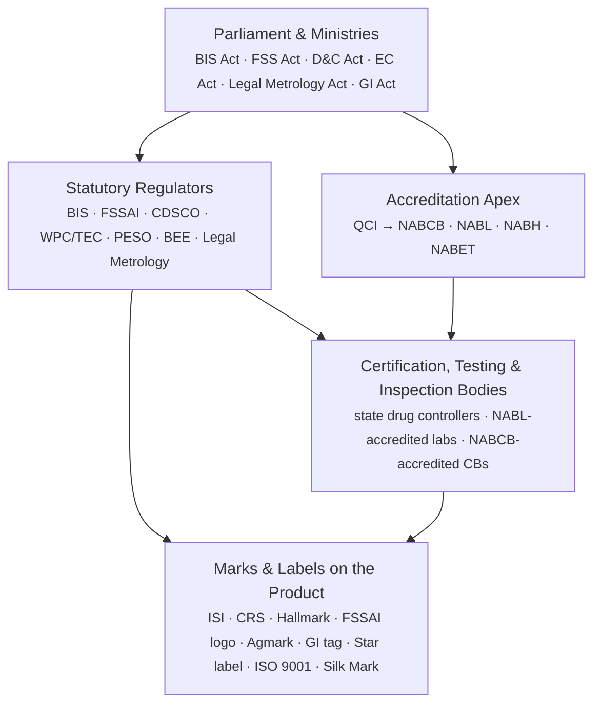

# How India regulates quality

BIS (the Bureau of Indian Standards) is the body most people name when they
think of "quality certification in India," but it shares the field with
roughly three dozen statutory regulators, accreditation boards and voluntary
marks. This repository maps who does what, grounded in the actual Acts,
Quality Control Orders, and scheme notifications behind each mark — not just
descriptions of them.

## The four-layer model

India doesn't regulate quality through one law or one authority. It runs as
a stack of four layers:



1. **Parliament and the ministries** write the Acts — the BIS Act, the Food
   Safety and Standards Act, the Drugs & Cosmetics Act, the Energy
   Conservation Act, the Legal Metrology Act, the Geographical Indications
   Act, and others.
2. **Statutory regulators** each own one slice of risk and issue licences or
   mandatory marks under their own Act — BIS, FSSAI, CDSCO, the WPC Wing and
   TEC (telecom), PESO, BEE, Legal Metrology, and more.
3. A separate **accreditation apex** — the Quality Council of India (QCI) and
   its constituent boards (NABCB, NABL, NABH, NABET) — doesn't certify
   products at all. It certifies the certifiers, auditors and labs that
   other regulators and the market rely on.
4. Beneath that sit the actual **certification, testing and inspection
   bodies** — some public (BIS itself, state drug controllers), most private
   but accredited — who do the testing and put a mark on the product.

Two things trip people up:

- **A mark can be mandatory for one product and voluntary for another.** The
  ISI mark is optional on most goods but compulsory the moment a product is
  named in a Quality Control Order (QCO) — over 150 product categories do
  today, and the list keeps growing (furniture joined in 2025; "Scheme-X"
  for machinery and electrical gear takes effect September 2026).
- **ISO certificates and government marks are different systems that share
  infrastructure.** An ISO 9001 certificate comes from a private
  certification body, but that body is only credible because NABCB (under
  QCI) accredited it. BIS also happens to sell ISO certification itself, as
  one certification body among many — that's a separate, voluntary
  commercial scheme, not a regulatory requirement.

## How this repository is organised

```
docs/
  00-overview.md                  — this file
  apex-accreditation/              — QCI, NABCB, NABL, NABH, NABET
  bis-core/                        — ISI mark, CRS, Hallmarking, BIS-as-a-CB, Ecomark, STQC
  food-agriculture/                — FSSAI, AGMARK, APEDA/NPOP, PGS-India, Spices/Tea/Coffee Boards, MPEDA
  health-pharma/                   — CDSCO, state drug controllers, AYUSH GMP
  energy-safety-environment/       — BEE star label, PESO, AERB, CPCB
  telecom-electronics/             — WPC/ETA, TEC/MTCTE
  textiles/                        — Silk Mark, Handloom Mark, Textiles Committee
  ip-trademarks/                   — GI Registry, Certification Trademarks
  legal-metrology/                 — Legal Metrology
  private-voluntary/               — Halal certification, Woolmark, GreenPro/IGBC/GRIHA

sources/
  <same categories>/               — mirrored primary-source PDFs/HTML (Acts, QCOs, notifications, scheme pages)
  <same categories>/MANIFEST.md    — origin URL, fetch date and notes for every mirrored file
```

Each page under `docs/` follows the same shape: authority, legal basis,
mandatory/voluntary status, what it actually certifies, the mark you'd see
on a product, and a link to the primary source mirrored under `sources/`.

## Reading the marks correctly

This is an orientation map, not a compliance checklist. Whether a specific
product needs BIS registration, which QCO applies, or which CDSCO device
class a product falls into depends on current notifications and changes
often. Verify against the regulator's current gazette notification before
relying on anything here for a filing. See each page's "Primary source"
link and its fetch date — a scheme notified after that date won't be
reflected yet.
